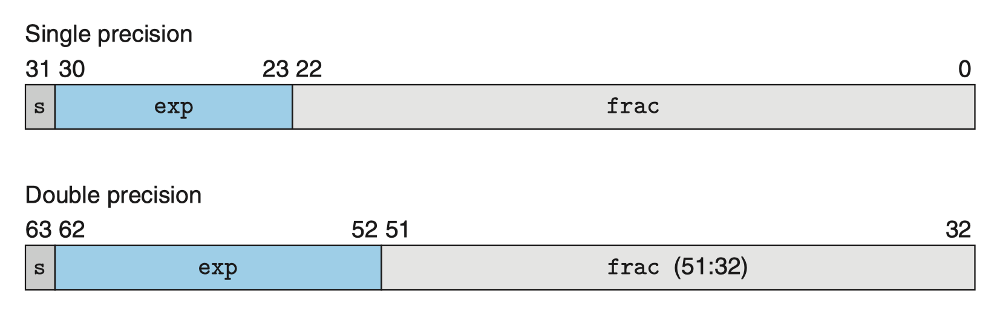

# 更适合北大宝宝体质的 Data Lab 踩坑记

Data lab 是 ICS 的第一个 lab，虽然说出来可能会很打击大家的积极性，但它确实也是 ICS 最简单的一个 lab。

在这个 lab 中，我们需要在各种限制下，基于位运算和逻辑运算，实现一些函数，这些函数也被称为谜题（puzzle）。

这些 puzzle 包括：

位运算：

| 名称                     | 描述                                 | 评分 | 最大操作次数 |
| ------------------------ | ------------------------------------ | ---- | ------------ |
| bitXnor (x)              | 仅使用～和 \| 来实现 (x ^ y)         | 1    | 7            |
| bitConditional (x, y, z) | 对每个比特分别执行 x ? y : z         | 1    | 4            |
| byteSwap (x, n, m)       | 交换第 n 字节和第 m 字节             | 2    | 16           |
| logicalShift (x, n)      | 向右逻辑移位 x，通过 n 位            | 3    | 16           |
| cleanConsecutive1 (x)    | 清除 x 的二进制形式中连续的 1        | 4    | 16           |
| leftBitCount (x)         | 计算 x 的二进制形式中前导的 1 的数量 | 4    | 50           |

补码运算：

| 名称                | 描述                                                      | 评分 | 最大操作次数 |
| ------------------- | --------------------------------------------------------- | ---- | ------------ |
| counter1To5 (x, n)  | 如果 x<5，返回 1+x，否则返回 1                            | 2    | 15           |
| sameSign (x, y)     | 如果 x 和 y 符号相同，返回 1，否则返回 0                  | 2    | 5            |
| satMul3 (x)         | 将 x 乘以 3，如果溢出，上 / 下取到 $T_{min}$ 或 $T_{max}$ | 3    | 25           |
| isGreater (x, y)    | 如果 x>y，返回 1，否则返回 0                              | 3    | 24           |
| subOK (x, y)        | 确定是否可以计算 x−y 而不溢出                             | 3    | 20           |
| trueFiveEighths (x) | 将 x 乘以 5/8，避免溢出错误                               | 4    | 25           |

浮点运算：

| 名称              | 描述                  | 评分 | 最大操作次数 |
| ----------------- | --------------------- | ---- | ------------ |
| float_half (x)    | 计算 x/2              | 4    | 30           |
| float_i2f (x)     | 将整数 x 转换为浮点数 | 4    | 30           |
| float64_f2i (x)   | 将双精度 x 转换为整数 | 4    | 20           |
| float_negpwr2 (x) | 计算 2 的 (-x) 次幂   | 4    | 20           |

我们的所有代码编写，都是在 `bits.c` 中进行的。

## 写前须知

在一切开始之前，请记得先解压 `datalab-handout.tar`，并进入 `datalab-handout` 工作目录。

```bash
# 解压
tar -xvf datalab-handout.tar
# 进入工作目录
cd datalab-handout
# 编译
make
```

本 lab 要求在 Linux 环境下完成。Mac 和 Windows 均不适用，你可以考虑使用：

-   WSL2（Windows Subsystem for Linux 2）：具体信息请自行搜索
-   Class Machine：由助教团队提供
-   云服务器：如腾讯云、阿里云等

如果你的服务器是 64 位系统，那么你使用 `make` 编译的时候，可能会遇到如下错误：

```bash
/usr/include/limits.h:26:10: fatal error: bits/libc-header-start.h: No such file or directory
   26 | #include <bits/libc-header-start.h>
      |          ^~~~~~~~~~~~~~~~~~~~~~~~~~
compilation terminated.
make: *** [Makefile:11: btest] Error 1
```

这是因为你的系统缺少了 `gcc-multilib`，你可以通过如下命令安装：

```bash
# Ubuntu
sudo apt-get install gcc-multilib
```

### 代码风格

-   不允许使用循环、条件语句（除非另有说明，如后续的浮点谜题）
-   只有如下操作符可以使用：`!`、`~`、`&`、`^`、`|`、`+`、`<<`、`>>`（除非另有说明）
-   每个函数都存在一个最大操作次数的限制，**大于或等于这个限制数，将会被扣分**
-   禁止使用宏，定义其他函数、调用其他函数
-   禁止使用形式转换类型
-   某些函数进一步限制了可以使用的操作符、常量和变量的数量
-   函数变量一定要声明在函数顶部，不允许在函数中间声明变量

### 测评

`btest`：用于测试你的函数是否正确。仅在一个小的测试集上进行测试，不能完全保证你的函数是正确的。

```bash
# 编译并运行
make && ./btest
# 对某个函数进行单元测试
make && ./btest -f bitXnor
# 对某个函数进行单元测试，且指定测试用例，以 -1 指定第一个参数，依次类推
make && ./btest -f bitXnor -1 7 -2 0xf
```

注意，这里的 `make` 是必需的，每当你修改了 `bits.c`，都需要重新编译。有关编译的更多知识，你会在第七章学习到。

`dlc`：用于检查你的代码是否符合规范。

```bash
# 检查是否符合编码规范
./dlc bits.c
```

`bdd checker`：穷举测试所有可能的输入，完整地检查你的函数是否正确。

```bash
# 对某个函数进行单元测试
./bddcheck/check.pl -f bitXnor
# 检查所有函数
./bddcheck/check.pl
# 检查所有函数，且输出总结信息
./bddcheck/check.pl -g
```

`driver.pl`：用于评分，检查你的函数是否符合规范且正确。

```bash
./driver.pl
```

### 辅助工具

要使用辅助工具，你必须先编译：

```bash
make
```

`ishow`：用于显示整数的二进制形式。

```bash
# 显示 -1 的二进制形式
./ishow -1
# Hex = 0xffffffff,       Signed = -1,    Unsigned = 4294967295

# 以 0x 开头，十六进制表示转整数
./ishow 0xffffffff
# Hex = 0xffffffff,       Signed = -1,    Unsigned = 4294967295
```

`fshow`：用于显示浮点数的二进制形式。

```bash
# 带小数点，浮点数转表示
./fshow 12.0
# Floating point value 12
# Bit Representation 0x41400000, sign = 0, exponent = 0x82, fraction = 0x400000
# Normalized.  +1.5000000000 X 2^(3)

# 不带小数点，表示转浮点数
./fshow 12
# Floating point value 1.681558157e-44
# Bit Representation 0x0000000c, sign = 0, exponent = 0x00, fraction = 0x00000c
# Denormalized.  +0.0000014305 X 2^(-126)

# 不带小数点，以 0x 开头，十六进制表示转浮点数
./fshow 0x41400000
# Floating point value 12
# Bit Representation 0x41400000, sign = 0, exponent = 0x82, fraction = 0x400000
# Normalized.  +1.5000000000 X 2^(3)
```

## bitXnor

-   要求：仅使用 `~` 和 `|` 来实现 `~(x ^ y)`
-   允许的操作符：`~`、`|`
-   最大操作次数：7
-   评分：1

利用离散数学中学过的德摩根律，我们可以对此式进行变换：

$$
\begin{align*}
\because x \text { AND } y &= \sim(\sim x \text{ OR } \sim y) \\
\therefore x \text{ XNOR } y &= \sim(x \text{ XOR } y) \\
&= (\sim x \text{ AND } \sim y) \text{ OR } (x \text{ AND } y ) \\
&= \sim(x \text{ OR } y) \text{ OR } \sim(\sim x \text{ OR } \sim y) \\
\end{align*}
$$

$$
\text{bitXnor}(x, y) = \sim(x \text{ OR } y) \text{ OR } \sim(\sim x \text{ OR } \sim y)
$$

注：`XNOR` 是 `XOR` 运算的否定。

所以我们得到：

```c
int bitXnor(int x, int y) {
   return ~(x | y) | ~(~x | ~y);
}
```

## bitConditional

-   要求：对每个比特（位）分别执行 `x ? y : z`
-   允许的操作符：`~`、`&`、`^`、`|`
-   最大操作次数：4
-   评分：1

我们利用 `x` 的每一位，来决定选择 `y` 还是 `z` 的一位（也即利用 `&` 的短路特性）：

```c
int bitConditional(int x, int y, int z) {
   // 对每一位，如果 x_i 为 1，那么选择 y_i，否则选择 z_i
   return (x & y) | (~x & z);
}
```

## byteSwap

-   要求：交换第 `n` 字节和第 `m` 字节
-   允许的操作符：`!`、`~`、`&`、`^`、`|`、`+`、`<<`、`>>`
-   最大操作次数：16
-   评分：2

想要完成这个谜题，需要我们理解一个叫做 `mask`（掩码）的概念。

考虑如下真值表：

| x   | y   | x & y | x \| y |
| --- | --- | ----- | ------ |
| 0   | 0   | 0     | 0      |
| 0   | 1   | 0     | 1      |
| 1   | 0   | 0     | 1      |
| 1   | 1   | 1     | 1      |

我们可以发现，当 `x` 为 0 时，无论 `y` 为什么，`x & y` 都为 0；当 `x` 为 1 时，无论 `y` 为什么，`x & y` 都为 `y`。

基于这个特性，我们可以构造一个 `mask`，以之对某个数进行 `&` 运算，从而实现将某些位清零，而保留其他位不变的目的。

考虑到 1 个字节有 8 位，我们可以构造 `mask` 如下，其实现了对于 `x` 只保留第 `n` 个字节，而将其他字节清零的目的：

```c
// n << 3 表示 n * 8
int n_byte_mask = 0xff << (n << 3);
int n_byte = x & n_byte_mask;
```

我们继续利用这个特性，来实现 `byteSwap`：

```c
int byteSwap(int x, int n, int m) {
   // 首先保存原始x，然后在对应的byte上按位与消去，再按位或上交换后的byte
   int origin = x, clip_mask, swap_mask;
   n <<= 3, m <<= 3;
   // 0xff << n 表示将第 n 个字节保留，其他字节清零
   // 取反后，表示将第 n 个字节清零，其他字节保留
   clip_mask = ~((0xff << n) | (0xff << m));
   x &= clip_mask;
   // 先通过右移 n*8 位，将第 n 个字节移动到第 0 个字节，与 0xff 进行与运算，得到第 n 个字节，再左移 m*8 位，即实现将第 n 个字节移动到第 m 个字节
   swap_mask = (0xff & (origin >> n)) << m | (0xff & (origin >> m)) << n;
   // 完形填空
   x |= swap_mask;
   return x;
}
```

关于掩码的思想十分重要，我们不仅在后续的谜题中会用到，而且在后续的课程中接触各种各样的位向量时，也会用到。

## logicalShift

-   要求：把 `x` 逻辑右移 `n` 位
-   允许的操作符：`!`、`~`、`&`、`^`、`|`、`+`、`<<`、`>>`
-   最大操作次数：16
-   评分：3

逻辑右移，即在右移的过程中，左边补 0。

直接使用 `>>` 运算符，会导致算术右移，即在右移的过程中，左边补符号位。

所以，我们需要一个 `mask`，其可以在逻辑右移后，对于负数（即最高位为 1）的情况，将算数右移导致的额外的前导 1 清零。

我们可以通过模拟 `Tmin` 算数右移 `n` 位的过程，从而获得这个掩码。

```c
int logicalShift(int x, int n) {
   // 对Tmin（最高位为1）执行同样的右移操作，然后左移一位取反即得所需掩码
   int mask = ~(1 << 31 >> n << 1);
   return x >> n & mask;
}
```

由于存在对于大常量的使用限制，这里使用 `1 << 31` 来构造 `Tmin`，即最高位为 1，其他位为 0 的数。

## cleanConsecutive1

-   要求：清除 `x` 的二进制形式中连续的 1
-   允许的操作符：`!`、`~`、`&`、`^`、`|`、`+`、`<<`、`>>`
-   最大操作次数：16
-   评分：4

最容易想到的方法就是，通过将 `x` 分别左移、右移 1 位，获得两个 `mask`，再以这两个 `mask` 取或构造出一个新的、标志了连续 1 的 `consecutive1_mask`，对之取反，即得需要保留的位。最后将 `x` 与 `~consecutive1_mask` 进行 `&` 运算，即可实现清除连续 1 的目的。

```c
int cleanConsecutive1(int x) {
   // 左右移动一位成为mask，左侧mask要额外考虑算数右移对最高位的影响
   int right_mask = x << 1;
   int left_mask = x >> 1 & ~(1 << 31);
   x &= ~(right_mask | left_mask);
   return x;
}
```

另外一种思路十分精巧，通过首先执行 `int cur_and_right_mask = x & (x << 1)`，获得了一个当前位和右侧位都为 1 的掩码，随后执行 `cur_and_right_mask | (cur_and_right_mask >> 1)`，实现了对于连续 1 的掩码。

为了更方便理解，举例如下（注意，`i` 从低位向高位增长，最低位为第 0 位，`t` 同 `cur_and_right_mask`）：

1. $t_i$ = 1 当且仅当 $x_i$ = 1 且 $x_{i-1}$ = 1
2. 所以 `t` 标记了 `x` 中，当前位和右侧位都为 1 的位
3. 执行 `(t | t >> 1)`，可以在 `t` 的基础上，将右侧位（即 $x_{i-1}$ ）也标记为 1，也即额外标记了 `x` 中当前位和左侧位都为 1 的位
4. 由于连续为 1 的位，要么是当前位和右侧位都为 1，要么是当前位和左侧位都为 1，所以执行 `x & ~(t | t >> 1)`，可以将 `x` 中连续为 1 的位清零
5. 额外利用 `x` 和 `t` 的关系，4 中式子可以进一步化简为 `x ^ (t | t >> 1)`，即 `x` 和 `t | t >> 1` 的异或

关于 5，额外解释如下：

1. 当 $x_i$ = 0 时，$t_i$ = 0，$t_{i+1}$ = 0，所以 $(t | t >> 1)_i$ = 0，$x_i$ 异或 0，结果不变
2. 当 $x_i$ = 1 时，当且仅当 $t_i$ 和 $t_{i+1}$ 任一为 1 时，$(t | t >> 1)_i$ = 1，$x_i$ 异或 1，即将 $x_i$ 置 0，此时即对应了连续为 1 的位

所以此题的解法如下：

```c
int cleanConsecutive1(int x) {
   int t = x & (x << 1);
   return x & ~(t | t >> 1);
   // 或
   // return x ^ (t | t >> 1);
}
```

## leftBitCount

-   要求：计算 `x` 的二进制形式中最高位开始的前导 1 的数量
-   允许的操作符：`!`、`~`、`&`、`^`、`|`、`+`、`<<`、`>>`
-   最大操作次数：50
-   评分：4

这题的最大操作次数给的十分慷慨，但这并不代表这题很简单。

这题的主要思路是，利用任何一个数都能被唯一地表示为二进制，也即只能被唯一的拆分为 $\sum_{i=0}^{31} a_i \times 2^i$ 的形式，所以我们可以如下进行判断（伪代码）：

```c
int leftBitCount(int x) {
   int ans = 0;
   if (x 最高 16 位均为 1){
      ans += 16;
      x = x << 16;
   }
   if (x 最高 8 位均为 1){
      ans += 8;
      x = x << 8;
   }
   if (x 最高 4 位均为 1){
      ans += 4;
      x = x << 4;
   }
   if (x 最高 2 位均为 1){
      ans += 2;
      x = x << 2;
   }
   if (x 最高 1 位均为 1){
      ans += 1;
      x = x << 1;
   }
   // 对于 32 位全为 1 的情况特判
   if (x == -1){
      ans += 1;
   }
}
```

接下来，我们需要思考如何使用位运算，实现判断 `x` 最高 16 位是否均为 1。

这等价于判断 `~x` 最高 16 位是否均为 0。

基于此，我们设计实现思路如下：

```c
int tmin = 1 << 31;
int is_high_16_all_1 = !(~(x & (tmin >> 15)) >> 16)
```

其中，`is_high_16_all_1` 为 1，当且仅当 `~(x & (tmin >> 15))` 最高 16 位均为 0，也即 `x` 最高 16 位均为 1。

继续应用这个思路，我们就可以实现 `leftBitCount`（为了简便起见，各变量命名为 $pt\_2^n$）：

```c
int leftBitCount(int x) {
   // 采用二分法，注意到返回的ans结果一定可以分解为2的幂次(Power of Two)之和。
   // 所以，每次判断x的高2^n次是否全为1，然后累积相加即可。每次计算完了之后左移相应的位数。
   int tmin = 1 << 31;
   int ans = 0, pt_16, pt_8, pt_4, pt_2, pt_1, is_neg_1;
   pt_16 = (!(~(x & (tmin >> 15)) >> 16)) << 4;
   ans += pt_16;
   x <<= pt_16;
   pt_8 = (!(~(x & (tmin >> 7)) >> 24)) << 3;
   ans += pt_8;
   x <<= pt_8;
   pt_4 = (!(~(x & (tmin >> 3)) >> 28)) << 2;
   ans += pt_4;
   x <<= pt_4;
   pt_2 = (!(~(x & (tmin >> 1)) >> 30)) << 1;
   ans += pt_2;
   x <<= pt_2;
   pt_1 = (!(~(x & tmin) >> 31));
   ans += pt_1;
   x <<= pt_1;
   is_neg_1 = x >> 31 & 1;
   ans += is_neg_1;
   return ans;
}
```

## counter1To5

-   要求：如果 `x<5`，返回 `1+x`，否则返回 `1`
-   允许的操作符：`~`、`&`、`!`、`|`、`+`、`<<`、`>>`
-   最大操作次数：15
-   评分：2
-   题目保证：`1 <= x <= 5`

首先，我们思考一下如何判断 `x` 是否等于 5。

我们立刻想到，这可以通过异或运算来实现，即判断 `x ^ 5` 是否为 0。

然而不幸的是，这道题禁止使用 `^` 异或操作符。那么我们应该如何实现异或运算呢？

我们可以使用位级异或运算

```c
int bitXor(int x, int y) {
   return (~x & y) | (x & ~y);
}
```

这段代码的核心思想是，其返回的结果 `res` 的每一位 `res_i` 为 0，当且仅当：

-   `x_i` 为 0 的位上，`y_i` 也必然为 0，这样才能使 `~x_i & y_i` 为 0
-   `x_i` 为 1 的位上，`y_i` 也必然为 1，这样才能使 `x_i & ~y_i` 为 0

这也就等价于，`res_i` 为 0，当且仅当 `x_i` 和 `y_i` 相等。

这正是异或运算的定义。

结合这个思路，再额外注意到 1 的二进制形式为 `0x00000001`，-4 的二进制形式为 `0xfffffffc`（高 30 位均为 1，低 2 位均为 0），我们可以得到实现如下：

```c
int counter1To5(int x) {
   // 使用异或判断x是否为5，然后根据结果加1或者减4
   int is_equal = !((~x & 5) | (~5 & x));
   return x + !is_equal + ((is_equal << 31 >> 29));
}
```

这里还有一个技巧就是，如何快速获得 -4 的二进制形式？

我们利用书上讲到的：对于非 `Tmin` 的补码，均有 `-x = ~x + 1`，所以我们令 `x = 4`，即得其二进制表示为 `0...0100`，对之取反，得 `1...1011`，再加 1，得 `1...1100`，即 `-4` 的二进制表示。

## sameSign

-   要求：如果 `x` 和 `y` 符号相同，返回 `1`，否则返回 `0`
-   允许的操作符：`!`、`~`、`&`、`^`、`|`、`+`、`<<`、`>>`
-   最大操作次数：5
-   评分：2

由于符号位都位于最高位，所以我们只需要对 `x` 和 `y` 进行逻辑右移 31 位，再进行 `^` 异或运算，然后使用 `!` 运算符，即可实现。

```c
int sameSign(int x, int y) {
   // 逻辑右移31位，然后异或，最后取反
   return !((x >> 31) ^ (y >> 31));
   // 或者
   // return !((x ^ y)>>31);
}
```

另外一种解法是首先使用 `Tmin` 作为掩码，取得 `x` 和 `y` 各自的符号位：

```c
int sameSign(int x, int y) {
   // 分别计算x和y的符号位，然后异或判断是否相同
   int sign = 1 << 31;
   int x_sign = x & sign;
   int y_sign = y & sign;
   return !(x_sign ^ y_sign);
}
```

缺点是会多使用一个操作符。

## satMul3

-   要求：将 `x` 乘以 3，如果溢出，上 / 下取到 $T_{min}$ 或 $T_{max}$
-   允许的操作符：`!`、`~`、`&`、`^`、`|`、`+`、`<<`、`>>`
-   最大操作次数：25
-   评分：3

首先，先思考怎么在位级运算中计算出 `x * 3`。

很自然的想法是：

```c
int mul2 = x << 1; // 或者 x + x
int mul3 = mul2 + x;
```

如果没有发生溢出，那么 `x`、`mul2`、`mul3` 的符号位应该均相。所以我们可以通过判断是否满足这个条件，来确定是否发生了溢出。

```c
int is_overflow = (x ^ mul2) >> 31;
is_overflow |= (mul2 ^ mul3) >> 31;
```

这里进行算数右移 31 位的原因是因为我们希望将 `is_overflow` 的每一位都搞成相同的 1（对应溢出的情况）或者相同的 0（对应未溢出的情况），从而使之可以作为一个掩码。

再考虑如何在溢出的情况下，根据 `x` 的符号位，返回 $T_{min}$ 或 $T_{max}$。

-   Tmin 的位级表示：10...0
-   Tmax 的位级表示：01...1

从而我们可以通过如下代码实现此功能：

```c
int x_sign_mask = x >> 31;
int tmin = 1 << 31;
int max_num = x_sign_mask & tmin | ~x_sign_mask & ~tmin;
// 或者
int max_num = ~(x_sign_mask ^ tmin);
```

最后，我们将这些思路整合起来，即可实现 `satMul3`：

```c
int satMul3(int x) {
   // 利用异或判断符号位是否相同（即是否溢出），并生成溢出标志is_overflow(0xffffffff or 0x0)
   // 然后使用位级条件运算，判断是否需要计算溢出后的值。溢出后的值利用Tmin异或得到。
   int is_overflow, mul_2, mul_3, tmin, x_sign_mask;
   mul_2 = x << 1;
   mul_3 = mul_2 + x;
   is_overflow = (x ^ mul_2) >> 31;
   is_overflow |= (mul_2 ^ mul_3) >> 31;
   tmin = 1 << 31;
   x_sign_mask = x >> 31;
   return (~is_overflow & mul_3) | (is_overflow & ~(x_sign_mask ^ tmin));
}
```

或者：

```c
int satMul3(int x) {
   int is_overflow, mul_2, mul_3, tmin, tmax, x_sign_mask;
   mul_2 = x << 1;
   mul_3 = mul_2 + x;
   is_overflow = (x ^ mul_2) >> 31;
   is_overflow |= (mul_2 ^ mul_3) >> 31;
   tmin = 1 << 31;
   tmax = ~tmin;
   x_sign_mask = x >> 31;
   return (~is_overflow & mul_3) | (is_overflow & ((x_sign_mask & tmin) | (~x_sign_mask & tmax)));
}
```

实测这里使用 `btest` 测试会出现错误结果，但是使用 `bdd checker` 测试却是正确的，原因不明。

## isGreater

-   要求：如果 `x>y`，返回 `1`，否则返回 `0`
-   允许的操作符：`!`、`~`、`&`、`^`、`|`、`+`、`<<`、`>>`
-   最大操作次数：24
-   评分：3

首先，我们根据 `x` 和 `y` 的符号位来分类：

`x` 和 `y` 异号：那么显然只有 `x` 为正数，`y` 为负数的情况下，`x>y` 成立，这对应 `x` 的符号位为 0，`y` 的符号位为 1

`x` 和 `y` 同号：此时我们不能直接判断 `x - y` 的符号位，因为如果 `x = y` 的话，`x - y` 的符号位为 0，但是 `x` 和 `y` 显然不满足 `x>y`。

我们又想到：

$$
\begin{align*}
x > y &\Leftrightarrow x - y > 0 \\
&\Leftrightarrow x - y - 1 ≥ 0 \\
&\Leftrightarrow x - y - 1 \text{ 的符号位为 0}
\end{align*}
$$

从而我们可以得到如下代码：

```c
int isGreater(int x, int y) {
   // 若x,y符号不同，则必有x不为负且y为负
   // 若x,y符号相同，则必有x-y-1不为负（规避x=y的情况）
   int x_sign = x >> 31;
   int y_sign = y >> 31;
   int if_not_sign_equal = !!(!x_sign & y_sign);
   // 如果x-y>=0，则x+~y的符号位为0
   int x_minus_y = x + ~y;
   int if_sign_equal = !(x_sign ^ y_sign) & !(x_minus_y >> 31);
   return if_not_sign_equal | if_sign_equal;
}
```

## subOK

-   要求：如果 `x-y` 不会溢出，返回 `1`，否则返回 `0`
-   允许的操作符：`!`、`~`、`&`、`^`、`|`、`+`、`<<`、`>>`
-   最大操作次数：20
-   评分：3

因为 `x = y + (x-y)`，所以 `x - y` 溢出等价于 `y` 和 `(x-y)` 符号均与 `x` 符号不同。

（考虑课本图 2-26，大正数相加得负数，大负数相加得正数）

再结合有 `-y = ~y + 1`，我们可以得到如下代码：

所以我们可以通过如下代码实现：

```c
int subOK(int x, int y) {
    // 因为x=y+(x-y)，所以x-y溢出等价于 y 和 (x-y)符号均与x符号不同
    // （考虑课本上那张图，大正数相加得负数，大负数相加得正数）
    return !(((x ^ y) & (x ^ (x + ~y + 1))) >> 31) & 1;
}
```

特别地，由于 `y = Tmin` 的时候不满足 `-y = ~y + 1`，所以我们需要特别讨论一下：

如果 `y = Tmin` ，那么 `(~y + 1) = y`，所以原式等价于 `!(((x ^ y) & (x ^ (x + y)) >> 31) & 1`。

当 `x` 为负数时（对应其最高位为 1），由于 `y` 的最高两位为 `10`，所以 `x + y` 的最高位必为 0，于是有原式等于 `!((1 ^ 1) & (1 ^ 0))`，也就是 1，这是正确的。

当 `x` 为正数时（对应其最高位为 0），由于 `y` 的最高两位为 `10`，所以 `x + y` 的最高位必为 1，于是有原式等于 `!((0 ^ 1) & (0 ^ 1))`，也就是 0，这也是正确的。

## trueFiveEighths

-   要求：计算 $\frac{5}{8}x$，向 0 舍入
-   允许的操作符：`!`、`~`、`&`、`^`、`|`、`+`、`<<`、`>>`
-   最大操作次数：25
-   评分：4

`5x` 很好实现，只需要 `x << 2 + x` 即可。

`y/8` 也很好实现，只需要 `y >> 3` 即可，然而回忆书上讲到的，右移实现的是向下舍入而非向 0 舍入，我们必须对此进行修正。

书 P73 曾说到，对于这种情况，我们可以对于负数特判，加上一个偏移量（bias），其等于 $2^k-1$，其中 $k$ 为右移的位数，然后再进行右移，就可以实现向 0 舍入。

基于此，我们可以得到如下代码：

```c
int trueFiveEighths(int x) {
    // 对于低3位（不能整除8的部分）特殊处理，因为他们会造成小数部分的误差，需要向零舍入
    // 利用书上给的向零舍入只需+2^3-1=7的办法，以x的符号位算数右移形成对于是否加7的mask即可
    int integer = x >> 3, fraction = x & 7;
    return integer + (integer << 2) + (fraction + (fraction << 2) + (x >> 31 & 7) >> 3);
}
```

## float_half

-   要求：计算浮点数 `f` 的 $\frac{1}{2}f$ 位级等效值，但是如果 `f` 是 NaN，直接返回 `f`
-   参数和结果都作为无符号整数传递，但它们应被解释为单精度浮点值的位级表示
-   允许的操作符：任何整数 / 无符号整数操作，包括 `||` 和 `&&`，同时允许条件语句和循环语句
-   最大操作次数：30
-   评分：4

首先，我们需要回顾一下 IEEE 754 单精度浮点数的表示方法，如下图所示（CS:APP 图 2-32）：



对于单精度浮点数（float），有：

-   符号位：1 位
-   指数位：8 位，偏移量为 $2^7-1=127$，对于非规格化数，其指数位全为 0，指数为 $2^{1-bias} = 2^{-126}$，对于规格化数，其指数位不全为 0，指数为 $2^{e-bias}$，其中 $e$ 为指数位的值
-   尾数位：23 位，对于非规格化数，尾数为 $0.f$，对于规格化数，尾数为 $1.f$

对于双精度浮点数（double），有：

-   符号位：1 位
-   指数位：11 位，偏移量为 $2^{10}-1=1023$，对于非规格化数，其指数位全为 0，指数为 $2^{1-bias} = 2^{-1022}$，对于规格化数，其指数位不全为 0，指数为 $2^{e-bias}$，其中 $e$ 为指数位的值
-   尾数位：52 位，对于非规格化数，尾数为 $0.f$，对于规格化数，尾数为 $1.f$

复习完了，让我们重新回到题目。要计算 $\frac{1}{2}f$，一个很朴素的想法就是直接对指数位进行减 1 操作即可。

然而，若以此法实现，我们还需要对以下几种情况进行特判：

-   当 `f` 为非规格化数时，其指数位全为 0，显然不能减 1，但此时我们只需要将尾数位右移 1 位即可
-   当 `f` 的指数位恰为 1 时，减 1 后会变成非规格化数，此时我们可以通过直接对指数位和尾数位整体进行右移 1 位的操作来弥补非规格化数的尾数位不加 1 的问题，然而同时带来了一个最低位是否要舍入的问题，需要我们进一步特判
-   当 `f` 为 NaN 时，我们需要直接返回 `f`

所以，我们可以得到如下代码：

```c
unsigned float_half(unsigned uf) {
   // 设置掩码提取各个部分的值，要额外注意浮点数运算存在舍入。
   int sign_mask = 0x80000000, exp_mask = 0x7f800000, frac_mask = 0x7fffff;
   int sign = uf & (sign_mask), exp = uf & exp_mask, frac = uf & frac_mask, round = !((uf & 3) ^ 3);
   if (!exp)
      return sign | ((frac >> 1) + round);
   if (exp == exp_mask) // Inf或者NaN
      return uf;
   if ((exp >> 23) == 1) // 如果Exp=1，那么右移一位后指数位变为0，同时弥补了非规格化数尾数不加 1 的问题，但是还需要额外判断是否需要舍入
      return sign | (((exp | frac) >> 1) + round);
   // 其他情况，直接在exp上减1即可
   return sign | (((exp >> 23) - 1) << 23 & exp_mask) | frac;
}
```

（回忆一下，浮点数的舍入方式是，四舍六入五成双，也即当最低位为 0 时，直接舍去，当最低位为 1 时，且次低位也为 1 时，才会需要进位）

## float_i2f

-   要求：将整数 `x` 转换为浮点数
-   参数和结果都作为无符号整数传递，但它们应被解释为单精度浮点值的位级表示
-   允许的操作符：任何整数 / 无符号整数操作，包括 `||` 和 `&&`，同时允许条件语句和循环语句
-   最大操作次数：30
-   评分：4

我们知道，其实 `int` 和 `float` 都是基于二进制的表示方法，这给于了我们基于位操作实现此函数的基础。

同时我们也知道，一个 `int` 有 32 位，其中有 31 位可以用以表示精度，而 `float` 的尾数位有 23 位，所以我们需要将 `int` 的精度位右移 8 位（即损失 8 位精度），从而得到 `float` 的尾数位。同时，我们还需要根据 “四舍六入五成双” 的原则，对于最低位是否要舍入进行判断。

于是，我们可以得到如下代码：

```c
unsigned float_i2f(int x) {
   unsigned sign = x >> 31 & 1, exp, frac, round;
   int x_exp, frac_mask;
   if (!x) // x=0，会在求x最高非零位时出错，所以特判
      return 0;
   if (!(x ^ (1 << 31))) // x=TMin，会在下一步对x取反过程中出错，所以特判
      return 0xcf << 24;
   if (sign)
      x = -x;
   // x_exp 代表 x 的最高非零位的位置，也即 x 的精度位的最高位的位置
   x_exp = 31;
   while (!(x >> x_exp))
      x_exp--;
   exp = x_exp + 0x7f; // exp+bias
   x <<= (31 - x_exp); // 得到小数部分
   frac_mask = 0x7fffff;
   // 右移 8 位，使得尾数位对齐
   frac = (x >> 8) & frac_mask;
   round = x & 0xff; // 得到要被舍入的小数部分
   frac += ((round > 0x80) || ((round == 0x80) && (frac & 1))); // 等价于判断是否大于128，或者等于128且最低位为1，即向偶数舍入
   // 对于舍入后进位的情况，因为最高位从23变为24，所以要且上一个掩码，而且增加一位阶码
   if (frac >> 23) {
      frac &= frac_mask;
      exp += 1;
   }
   return sign << 31 | exp << 23 | frac;
}
```

## float64_f2i

-   要求：将浮点数 `f` 转换为整数
-   参数作为无符号整数传递，但它应被解释为双精度浮点值的位级表示，且第一个参数表示的是低 32 位，第二个参数表示的是高 32 位
-   如果 `f` 不能用整数表示（例如超出表示范围、或者是 NaN），返回 0x80000000
-   允许的操作符：任何整数 / 无符号整数操作，包括 `||` 和 `&&`，同时允许条件语句和循环语句
-   最大操作次数：20
-   评分：4

回忆之前提到的，对于双精度浮点数（double），有：

-   符号位：1 位
-   指数位：11 位，偏移量为 $2^{10}-1=1023$，对于非规格化数，其指数位全为 0，指数为 $2^{1-bias} = 2^{-1022}$，对于规格化数，其指数位不全为 0，指数为 $2^{e-bias}$，其中 $e$ 为指数位的值
-   尾数位：52 位，对于非规格化数，尾数为 $0.f$，对于规格化数，尾数为 $1.f$

从而我们知道，一个 `double` 有 52 位精度，而 `int` 只有 31 位精度，这不可避免的会导致精度损失。

同时，一个 `int` 最多只有 31 位精度，也代表了其表示范围不超过 `-2^31 ~ 2^31-1`，这是我们得以判断是否发生了溢出的基础。

我们还注意到，对于 `double` 中，指数位小于等于偏移量 1023 的数，其指数必为 2 的负幂次（特别地，对于 ±0，有除符号位外全为 0 的表示方式），这些数在转换为 `int` 时，必然会舍入到 0。

所以，我们可以得到如下代码：

```c
int float64_f2i(unsigned uf1, unsigned uf2) {
    unsigned sign = (uf2 >> 31);
    int exp_mask = 0x7ff;
    int exp = ((uf2 >> 20) & exp_mask) - 1023;
    unsigned frac = ((uf2 & 0xfffff) << 11) | (((uf1 >> 21) & exp_mask)) | (0x80000000); // uf2的低20位+uf1的高11位
    if (exp < 0)
        return 0;
    if (exp >= 31)
        return 0x80000000;
    frac = (frac >> (31 - exp)) & ~(0x80000000 >> (31 - exp) << 1); // 避免算数右移导致的前导 1
    if (sign)
        return -frac;
    return frac;
}
```

## float_negpwr2

-   要求：计算 $2.0^{-x}$ 的浮点表示
-   如果得到的结果太小以至于是一个非规格化数，返回 0；如果得到的结果太大以至于无法表示成浮点数，返回 $+\infin$
-   参数和结果都作为无符号整数传递，但它们应被解释为单精度浮点值的位级表示
-   允许的操作符：任何整数 / 无符号整数操作，包括 `||` 和 `&&`，同时允许条件语句和循环语句
-   最大操作次数：20
-   评分：4

首先思考那些数可以被表示为浮点数。

我们知道，对于单精度浮点数（float），其指数位的偏移量为 $2^7-1=127$，指数位的范围为 $[0, 255]$，对应的指数范围为 $[-126, 128]$。其中，指数位为 0 的数为非规格化数，指数位为 255 的数为 NaN 或者 Inf，其他数为规格化数。

最小的非规格化数的位级表示为 `0x00000001`，对应的指数位为 0，尾数为 $2^{-23}$，所以最小的非规格化数为 $2^{-126} \times 2^{-23} = 2^{-149}$。

所以任何满足 $-x \lt -149$ ，也即 $x \gt 149$ 的数，都需要舍入为 0。

而最大的规格化数的位级表示为 `0x7f7fffff`，对应的指数为 254，尾数为 $2-2^{-23}$，所以最大的规格化数为 $2^{127} \times (2-2^{-23}) = 2^{128} - 2^{104}$。

再往上，就需要指数位全为 1，这时候就是 Inf 了。

也即，对于任何满足 $-x \geq 128$ ，也即 $x \leq -128$ 的数，都需要舍入为 Inf。

所以，我们可以得到如下代码：

```c
unsigned float_negpwr2(int x) {
    // 不对x先做到阶码位的转换，因为可能会造成溢出，而是直接判断x的范围，然后返回对应的值
    // -x < -149=1-127-23，即最小的非规格化数
    if (x > 149)
        return 0;
    // -x >= 128=255-127，即最大的阶码
    if (x <= -128)
        return 0x7f800000;
    // -x > -127，即规格化数，此时小数全为0，阶码为-x+127
    if (x < 127)
        return (-x + 127) << 23;
    // -x 介于 -127 和 -149 之间，即非规格化数，阶码位全为0
    return 1 << (149 - x);
}
```

## 本地评分

运行：

```bash
make && ./driver.pl
```

得到下列分数：

```text
Correctness Results     Perf Results
Points  Rating  Errors  Points  Ops     Puzzle
1       1       0       2       7       bitXnor
1       1       0       2       4       bitConditional
2       2       0       2       15      byteSwap
3       3       0       2       6       logicalShift
4       4       0       2       8       cleanConsecutive1
4       4       0       2       42      leftBitCount
2       2       0       2       11      counter1To5
2       2       0       2       5       sameSign
3       3       0       2       15      satMul3
3       3       0       2       14      isGreater
3       3       0       2       9       subOK
4       4       0       2       11      trueFiveEighths
4       4       0       2       23      float_half
4       4       0       2       30      float_i2f
4       4       0       2       20      float64_f2i
4       4       0       2       9       float_negpwr2

Score = 80/80 [48/48 Corr + 32/32 Perf] (229 total operators)
```

至此，我们就完成了 Data Lab 的所有题目，Congratulations！

## 参考资料

-   [不周山 / 【读厚 CSAPP】I Data Lab](https://wdxtub.com/csapp/thick-csapp-lab-1/2016/04/16/)：我当时做的时候的主要参考资料。
-   [CS-icez / introduction-to-computer-systems](https://github.com/CS-icez/introduction-to-computer-systems/blob/main/Handin/1%20datalab/bits.c)：对于 `float` 浮点谜题的打表实现，可以用于卷排名。
