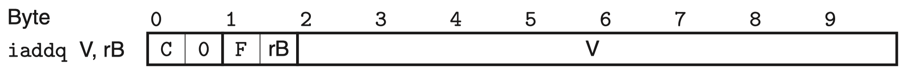

# 更适合北大宝宝体质的 Arch Lab 踩坑记

## PartA

本节所需程序在 `sim/misc` 下，要做的事情是编写 `.ys` 的汇编代码，然后执行：

```bash
./yas xxx.ys && ./yis xxx.yo
```

来实现所要求的功能即可。

在做本节内容前，推荐安装 VS Code Y86 语法扩展以获得高亮编码体验：

```
https://marketplace.visualstudio.com/items?itemName=abhinavk99.y86-vscode
```

### sum.ys

参照给出的示例代码 `y86-code`，总结出如下代码格式并通过：

```assembly
# 设置初始地址为0
    .pos 0
    irmovq stack, %rsp # 设置栈顶
    call main # 调用main函数
    halt # 终止程序

# 设置初始链表
    .align 8
ele1:
    .quad 0x00a
    .quad ele2
ele2:
    .quad 0x0b0
    .quad ele3
ele3:
    .quad 0xc00
    .quad 0

main:
    irmovq ele1, %rdi # 设置第一个元素的地址（即链表的头指针）为第一个参数
    call sum_list # 调用sum_list函数
    ret # 返回

sum_list:
    pushq %rbp # 保存rbp
    xorq %rax, %rax # 将rax(val)置零
    jmp test # 跳转到test\

loop:
    mrmovq (%rdi), %rsi # 将rdi指向的地址的值（即链表当前元素的值）赋给rsi
    addq %rsi, %rax # 将rsi的值加到rax中
    mrmovq 8(%rdi), %rdi # 将下一个元素的地址赋给rdi
    jmp test # 跳转到test

test:
    andq %rdi, %rdi # 比较rdi和0
    jne loop # 如果不相等，跳转到loop
    popq %rbp # 恢复rbp
    ret # 返回

# 设置栈顶地址
    .pos 0x200
stack:

```

这种写法是 `jump to the middle` 写法，特别要注意 `call` 和 `ret` 要匹配，否则即使你的程序停止了，也不是 `halt` 语句停止的，而是遇到了 `00` 内存停止的（可以最后观察 PC）。

也可以采用 `guarded do` 写法，因为注意到 `%rsi` 初始条件必不为零，所以可以改成：

```assembly
    .pos 0
    irmovq stack,%rsp
    call main
    halt

.align 8
ele1:
    .quad 0x00a
    .quad ele2
ele2:
    .quad 0x0b0
    .quad ele3
ele3:
    .quad 0xc00
    .quad 0

main:
    irmovq ele1, %rdi
    call sum_list
    ret

sum_list:
    pushq %r8
    xorq %rax,%rax
# grarded do
loop:
    andq %rdi,%rdi
    je loopEnd
    mrmovq (%rdi),%r8
    addq %r8,%rax
    mrmovq 8(%rdi),%rdi
    jmp loop
loopEnd:

    popq %r8
    ret

.pos 0x200
stack:

```

注意最后要多留一行空白行作为文件结尾。

运行：

```bash
./yas sum.ys && ./yis sum.yo
```

观察到

```
%rax:   0x0000000000000000      0x0000000000000cba
```

成功！

### rsum.ys

要求写个递归版本的，因为每次调用函数 val 都会改变，因而需要考虑使用 `pushq/popq` 保留局部变量：

```assembly
# 设置初始地址为0
    .pos 0
    irmovq stack, %rsp # 设置栈顶
    call main # 调用main函数
    halt # 终止程序

# 设置初始链表
    .align 8
ele1:
    .quad 0x00a
    .quad ele2
ele2:
    .quad 0x0b0
    .quad ele3
ele3:
    .quad 0xc00
    .quad 0

main:
    irmovq ele1, %rdi
    call rsum_list
    ret

rsum_list:
    andq %rdi, %rdi
    je base
    mrmovq (%rdi), %rdx
    pushq %rdx
    mrmovq $8(%rdi), %rdi
    call rsum_list
    popq %rdx
    addq %rdx, %rax
    ret

base:
    xorq %rax, %rax
    ret

    .pos 0x200
stack:

```

运行：

```bash
./yas rsum.ys && ./yis rsum.yo
```

观察到

```
%rax:   0x0000000000000000      0x0000000000000cba
```

成功！

### bubble.ys

要求使用冒泡排序，增序排序一个数组。

首先将代码转换为等价的 Goto 版本：

```c
void bubble_sort(long* data, long count) {
    long* last = data + count - 1;
test1:
    if (last <= data) {
        goto end;
    }
loop1:
    long* i = data;
test2:
    if (i >= last) {
        goto end2;
    }
loop2:
    if (*(i + 1) < *i) {
        long t = *(i + 1);
        *(i + 1) = *i;
        *i = t;
    }
    i++;
    goto test2;
end2:
    last--;
    goto test1;
end:
    return;
}

```

然后对着翻译就可以了。

其他还要注意的点就是，对于指针的加减，是按照类型的长度去加的，所以应当加 `(%rsi-1) * 8` 个字节才对。

以下是我 debug 了 2 个小时的代码，你看出来哪里错了吗？

```assembly
# 设置初始地址为0
    .pos 0
    irmovq stack, %rsp # 设置栈顶
    call main # 调用main函数
    halt # 终止程序
# 设置初始数组
    .align 8
Array:
    .quad 0xbca
    .quad 0xcba
    .quad 0xacb
    .quad 0xcab
    .quad 0xabc
    .quad 0xbac

main:
    irmovq Array, %rdi
    irmovq $6, %rsi
    call bubble_sort
    ret

bubble_sort:
    # rsi * 8
    addq %rsi, %rsi
    addq %rsi, %rsi
    addq %rsi, %rsi
    # 把 rsi 搞成 last，即 init-expr
    addq %rdi, %rsi
    # 加减的常数 r13 = 8
    irmovq $8, %r13
    subq %r13, %rsi

# 循环 1 的 text-expr
test:
    # last - data <= 0 就结束
    rrmovq %rdi, %r8 # data
    subq %rsi, %r8 # data - last
    jge end # data - last >= 0 跳转

loop1:
    # rbx 是 i
    # 第 2 个循环的 init-expr
    rrmovq %rdi, %rbx # i = data

test2:
    rrmovq %rbx, %r8 # i
    subq %rsi, %r8 # i - last
    jge end2 # i - last >= 0 跳转

loop2:
    # *i 是 r11，*(i+1) 是 r10
    mrmovq $8(%rbx), %r10 # r10 = *(i+1)
    mrmovq (%rbx), %r11 # r11 = *i
    rrmovq %r11, %r8 # r12 = *i
    subq %r10, %r8 # if (*i > *(i+1))
    jle end4
    rmmovq %r11, $8(%rbx)
    rmmovq %r10, (%rbx)

# 循环 2 的 update-expr
end4:
    addq %r13, %rbx
    jmp test2

# 循环 1 的 update-expr
end2:
    subq %r13, %rsi
    jmp test

# 循环 1 判断终止
end:
    ret

    .pos 200
stack:

```

哈哈，我也没看出来，我花了一个小时，疯狂的改逻辑都没看出来，甚至实在受不了了，往栈上 push 变量看，然后发现 push 几个就 ADR 了，这才发现我草，我怎么栈开的是 `200` 而不是 `0x200` ！

值得一提的是，我们虽然没有使用任何的 push/pop，但是错误的栈指针仍然导致了问题。这是因为我们使用了 ret/call 导致的。观察 `bubble.yo` 也可以发现，我们的程序代码已经占用了 `0x0 ~ 0xe1` 之间的所有空间，而 200 的 16 进制表示恰为 `0xc8`，所以在程序 ret 的时候会导致类似于之前 AttackLab 里出现的，“错误的执行 / 理解代码”

于是，略作修改就过了：

```assembly
# 设置初始地址为0
    .pos 0
    irmovq stack, %rsp # 设置栈顶
    call main # 调用main函数
    halt # 终止程序
# 设置初始数组
    .align 8
Array:
    .quad 0xbca
    .quad 0xcba
    .quad 0xacb
    .quad 0xcab
    .quad 0xabc
    .quad 0xbac

main:
    irmovq Array, %rdi
    irmovq $6, %rsi
    call bubble_sort
    ret

bubble_sort:
    # rsi * 8
    addq %rsi, %rsi
    addq %rsi, %rsi
    addq %rsi, %rsi
    # 把 rsi 搞成 last，即 init-expr
    addq %rdi, %rsi
    # 加减的常数 r13 = 8
    irmovq $8, %r13
    subq %r13, %rsi

# 循环 1 的 text-expr
test:
    # last - data <= 0 就结束
    rrmovq %rdi, %r8 # data
    subq %rsi, %r8 # data - last
    jge end # data - last >= 0 跳转

loop1:
    # rbx 是 i
    # 第 2 个循环的 init-expr
    rrmovq %rdi, %rbx # i = data

test2:
    rrmovq %rbx, %r8 # i
    subq %rsi, %r8 # i - last
    jge end2 # i - last >= 0 跳转

loop2:
    # *i 是 r11，*(i+1) 是 r10
    mrmovq $8(%rbx), %r10 # r10 = *(i+1)
    mrmovq (%rbx), %r11 # r11 = *i
    rrmovq %r11, %r8 # r12 = *i
    subq %r10, %r8 # if (*i > *(i+1))
    jle end4
    rmmovq %r11, $8(%rbx)
    rmmovq %r10, (%rbx)

# 循环 2 的 update-expr
end4:
    addq %r13, %rbx
    jmp test2

# 循环 1 的 update-expr
end2:
    subq %r13, %rsi
    jmp test

# 循环 1 判断终止
end:
    ret

    .pos 0x200
stack:

```

```
Changes to memory:
0x0018: 0x0000000000000bca      0x0000000000000abc
0x0020: 0x0000000000000cba      0x0000000000000acb
0x0028: 0x0000000000000acb      0x0000000000000bac
0x0030: 0x0000000000000cab      0x0000000000000bca
0x0038: 0x0000000000000abc      0x0000000000000cab
0x0040: 0x0000000000000bac      0x0000000000000cba
0x01f0: 0x0000000000000000      0x0000000000000065
0x01f8: 0x0000000000000000      0x0000000000000013
```

## PartB

需要在 `sim/seq` 目录下执行各指令。

具体需要用到的指令参见 handout，在此不赘述。

在做本节内容前，推荐安装 VS Code HCL 语法扩展以获得高亮编码体验与自动格式化：

```
https://marketplace.visualstudio.com/items?itemName=BojunRen.hcl-support
```

注意不要安装名为 `HCL Format` 的格式化代码插件，那个东西用了会导致问题。

### IADDQ

iaddq V, rB：将常量 V 加到 rB 上



> 附图来自英文原版 Computer_Systems_A_Programmers_Perspective (3rd) P405

参考 `irmovq` 指令，我们将 CSAPP P254 给出的 `iaddq` 指令修改为如下几个阶段

-   Fetch
    -   icode:ifun ← M1[PC]
    -   rA:rB ← M1[PC+1]
    -   valC ← M8[PC+2]
    -   valP ← PC+10
-   Decode
    -   valB ← R[rB]
-   Execute
    -   valE ← valC+valB
    -   Set CC
-   Memory
-   Write Back
    -   R[rB] ← valE
-   PC Update
    -   PC ← valP

> 为什么不能采用 rA 作为寄存器输入源？因为 valC 和 valA 都只能连接到 ALU A，所以只能采用 rB 作为的寄存器输入源，输入到 ALU_B。

正常写就好，没啥难的，只需注意：

-   务必在文件开头注明姓名学号与新指令的各个阶段做了什么的说明
-   iaddq 的 icode 为 IIADDQ（两个 I）
-   IIADDQ **会设置条件码**（这个特性在 PartC 中十分有用）
-   不要问为什么找不到写回寄存器的阶段，写回和译码是一起的。

### IJMQ

jm rB, V：跳转到 M [rB+V] 的地址

参考 `rmmovq` 与 `ret` 指令

-   Fetch
    -   icode:ifun ← M1[PC]
    -   rA:rB ← M1[PC+1]
    -   valC ← M8[PC+2]
    -   valP ← PC+10
-   Decode
    -   valB ← R[rB]
-   Execute
    -   valE ← valC+valB
-   Memory
    -   valM ← M8[valE]
-   Write Back
-   PC Update
    -   PC ← valM

也是没啥难的，甚至没啥需要注意的，只要别忘了写各个阶段干了什么就行。

只需要按照 handout 里给出的逐步做就好。

以下是 PartB 的完整答案：

```c
#  Stages for iaddq V, rB: add constant V to rB
#
# * Fetch
#   * icode:ifun ← M1[PC]
#   * rA:rB ← M1[PC+1]
#   * valC ← M8[PC+2]
#   * valP ← PC+10
# * Decode
#   * valB ← R[rB]
# * Execute
#   * valE ← valC+valB
#   * Set CC
# * Memory
# * Write Back
#   * R[rB] ← valE
# * PC Update
#   * PC ← valP
# ---------------------------
# Stages for jm rB, V: jump to M[rB+V]
#
# * Fetch
#   * icode:ifun ← M1[PC]
#   * rA:rB ← M1[PC+1]
#   * valC ← M8[PC+2]
#   * valP ← PC+10
# * Decode
#   * valB ← R[rB]
# * Execute
#   * valE ← valC+valB
# * Memory
#   * valM ← M8[valE]
# * Write Back
# * PC Update
#   * PC ← valM
#/* $begin seq-all-hcl */
####################################################################
#  HCL Description of Control for Single Cycle Y86-64 Processor SEQ   #
#  Copyright (C) Randal E. Bryant, David R. O'Hallaron, 2010       #
####################################################################

## Your task is to implement the iaddq instruction
## The file contains a declaration of the icodes
## for iaddq (IIADDQ)
## Your job is to add the rest of the logic to make it work

####################################################################
#    C Include's.  Don't alter these                               #
####################################################################

quote '#include <stdio.h>'
quote '#include "isa.h"'
quote '#include "sim.h"'
quote 'int sim_main(int argc, char *argv[]);'
quote 'word_t gen_pc(){return 0;}'
quote 'int main(int argc, char *argv[])'
quote '  {plusmode=0;return sim_main(argc,argv);}'

####################################################################
#    Declarations.  Do not change/remove/delete any of these       #
####################################################################

##### Symbolic representation of Y86-64 Instruction Codes #############
wordsig INOP 	'I_NOP'
wordsig IHALT	'I_HALT'
wordsig IRRMOVQ	'I_RRMOVQ'
wordsig IIRMOVQ	'I_IRMOVQ'
wordsig IRMMOVQ	'I_RMMOVQ'
wordsig IMRMOVQ	'I_MRMOVQ'
wordsig IOPQ	'I_ALU'
wordsig IJXX	'I_JMP'
wordsig ICALL	'I_CALL'
wordsig IRET	'I_RET'
wordsig IPUSHQ	'I_PUSHQ'
wordsig IPOPQ	'I_POPQ'
# Instruction code for iaddq instruction
wordsig IIADDQ	'I_IADDQ'
#Instruction code for jm instruction
wordsig IJM     'I_JM'

##### Symbolic represenations of Y86-64 function codes                  #####
wordsig FNONE    'F_NONE'        # Default function code

##### Symbolic representation of Y86-64 Registers referenced explicitly #####
wordsig RRSP     'REG_RSP'    	# Stack Pointer
wordsig RNONE    'REG_NONE'   	# Special value indicating "no register"

##### ALU Functions referenced explicitly                            #####
wordsig ALUADD	'A_ADD'		# ALU should add its arguments

##### Possible instruction status values                             #####
wordsig SAOK	'STAT_AOK'	# Normal execution
wordsig SADR	'STAT_ADR'	# Invalid memory address
wordsig SINS	'STAT_INS'	# Invalid instruction
wordsig SHLT	'STAT_HLT'	# Halt instruction encountered

##### Signals that can be referenced by control logic ####################

##### Fetch stage inputs		#####
wordsig pc 'pc'				# Program counter
##### Fetch stage computations		#####
wordsig imem_icode 'imem_icode'		# icode field from instruction memory
wordsig imem_ifun  'imem_ifun' 		# ifun field from instruction memory
wordsig icode	  'icode'		# Instruction control code
wordsig ifun	  'ifun'		# Instruction function
wordsig rA	  'ra'			# rA field from instruction
wordsig rB	  'rb'			# rB field from instruction
wordsig valC	  'valc'		# Constant from instruction
wordsig valP	  'valp'		# Address of following instruction
boolsig imem_error 'imem_error'		# Error signal from instruction memory
boolsig instr_valid 'instr_valid'	# Is fetched instruction valid?

##### Decode stage computations		#####
wordsig valA	'vala'			# Value from register A port
wordsig valB	'valb'			# Value from register B port

##### Execute stage computations	#####
wordsig valE	'vale'			# Value computed by ALU
boolsig Cnd	'cond'			# Branch test

##### Memory stage computations		#####
wordsig valM	'valm'			# Value read from memory
boolsig dmem_error 'dmem_error'		# Error signal from data memory


####################################################################
#    Control Signal Definitions.                                   #
####################################################################

################ Fetch Stage     ###################################

# Determine instruction code
word icode = [
	imem_error: INOP;
	1: imem_icode;		# Default: get from instruction memory
];

# Determine instruction function
word ifun = [
	imem_error: FNONE;
	1: imem_ifun;		# Default: get from instruction memory
];

bool instr_valid = icode in
	{ INOP, IHALT, IRRMOVQ, IIRMOVQ, IRMMOVQ, IMRMOVQ,
	       IOPQ, IJXX, ICALL, IRET, IPUSHQ, IPOPQ, IIADDQ, IJM };

# Does fetched instruction require a regid byte?
bool need_regids =
	icode in { IRRMOVQ, IOPQ, IPUSHQ, IPOPQ,
		     IIRMOVQ, IRMMOVQ, IMRMOVQ, IIADDQ, IJM };

# Does fetched instruction require a constant word?
bool need_valC =
	icode in { IIRMOVQ, IRMMOVQ, IMRMOVQ, IJXX, ICALL, IIADDQ, IJM };

################ Decode Stage    ###################################

## What register should be used as the A source?
word srcA = [
	icode in { IRRMOVQ, IRMMOVQ, IOPQ, IPUSHQ  } : rA;
	icode in { IPOPQ, IRET } : RRSP;
	1 : RNONE; # Don't need register
];

## What register should be used as the B source?
word srcB = [
	icode in { IOPQ, IRMMOVQ, IMRMOVQ, IIADDQ, IJM  } : rB;
	icode in { IPUSHQ, IPOPQ, ICALL, IRET } : RRSP;
	1 : RNONE;  # Don't need register
];

## What register should be used as the E destination?
word dstE = [
	icode in { IRRMOVQ } && Cnd : rB;
	icode in { IIRMOVQ, IOPQ, IIADDQ} : rB;
	icode in { IPUSHQ, IPOPQ, ICALL, IRET } : RRSP;
	1 : RNONE;  # Don't write any register
];

## What register should be used as the M destination?
word dstM = [
	icode in { IMRMOVQ, IPOPQ } : rA;
	1 : RNONE;  # Don't write any register
];

################ Execute Stage   ###################################

## Select input A to ALU
word aluA = [
	icode in { IRRMOVQ, IOPQ } : valA;
	icode in { IIRMOVQ, IRMMOVQ, IMRMOVQ, IIADDQ, IJM } : valC;
	icode in { ICALL, IPUSHQ } : -8;
	icode in { IRET, IPOPQ } : 8;
	# Other instructions don't need ALU
];

## Select input B to ALU
word aluB = [
	icode in { IRMMOVQ, IMRMOVQ, IOPQ, ICALL,
		      IPUSHQ, IRET, IPOPQ, IIADDQ, IJM } : valB;
	icode in { IRRMOVQ, IIRMOVQ } : 0;
	# Other instructions don't need ALU
];

## Set the ALU function
word alufun = [
	icode == IOPQ : ifun;
	1 : ALUADD;
];

## Should the condition codes be updated?
bool set_cc = icode in { IOPQ, IIADDQ };

################ Memory Stage    ###################################

## Set read control signal
bool mem_read = icode in { IMRMOVQ, IPOPQ, IRET, IJM };

## Set write control signal
bool mem_write = icode in { IRMMOVQ, IPUSHQ, ICALL };

## Select memory address
word mem_addr = [
	icode in { IRMMOVQ, IPUSHQ, ICALL, IMRMOVQ, IJM } : valE;
	icode in { IPOPQ, IRET } : valA;
	# Other instructions don't need address
];

## Select memory input data
word mem_data = [
	# Value from register
	icode in { IRMMOVQ, IPUSHQ } : valA;
	# Return PC
	icode == ICALL : valP;
	# Default: Don't write anything
];

## Determine instruction status
word Stat = [
	imem_error || dmem_error : SADR;
	!instr_valid: SINS;
	icode == IHALT : SHLT;
	1 : SAOK;
];

################ Program Counter Update ############################

## What address should instruction be fetched at

word new_pc = [
	# Call.  Use instruction constant
	icode == ICALL : valC;
	# Taken branch.  Use instruction constant
	icode == IJXX && Cnd : valC;
	# Completion of RET instruction.  Use value from stack
	icode in { IRET, IJM } : valM;
	# Default: Use incremented PC
	1 : valP;
];
#/* $end seq-all-hcl */

```

执行：

```bash
(cd ../ptest; make SIM=../seq/ssim TFLAGS=-ij)
```

通过！

```
./optest.pl -s ../seq/ssim -ij
Simulating with ../seq/ssim
  All 59 ISA Checks Succeed
./jtest.pl -s ../seq/ssim -ij
Simulating with ../seq/ssim
  All 96 ISA Checks Succeed
./ctest.pl -s ../seq/ssim -ij
Simulating with ../seq/ssim
  All 22 ISA Checks Succeed
./htest.pl -s ../seq/ssim -ij
Simulating with ../seq/ssim
  All 756 ISA Checks Succeed
```

## PartC

### 指令

需要在 `sim/pipe` 目录下执行各指令

有用指令包括：

#### 检查长度是否超过 1000 Byte 的限制

```bash
../misc/yas ncopy.ys && ./check-len.pl < ncopy.yo
```

#### 检查正确性

```bash
./correctness.pl
```

#### 修改 `pipe-full.hcl` 后，重新构建模拟器

```bash
make clean; make psim VERSION=full
```

#### 修改 `ncopy.ys` 后，检查 CPE、本地跑分

```bash
make drivers && ./benchmark.pl
```

### 优化思路

堪称本 Lab 最难的部分。

虽然 handout 中直接给出了直译版本的 ncopy，但是这显然没什么用：

```assembly
# Function prologue.
# %rdi = src, %rsi = dst, %rdx = len
ncopy:

##################################################################
# You can modify this portion
	# Loop header
	xorq %rax,%rax		# count = 0;
	andq %rdx,%rdx		# len <= 0?
	jle Done		# if so, goto Done:

Loop:
	mrmovq (%rdi), %r10	# read val from src...
	rmmovq %r10, (%rsi)	# ...and store it to dst
	andq %r10, %r10		# val <= 0?
	jle Npos		# if so, goto Npos:
	irmovq $1, %r10
	addq %r10, %rax		# count++
Npos:
	irmovq $1, %r10
	subq %r10, %rdx		# len--
	irmovq $8, %r10
	addq %r10, %rdi		# src++
	addq %r10, %rsi		# dst++
	andq %rdx,%rdx		# len > 0?
	jg Loop			# if so, goto Loop:
##################################################################
# Do not modify the following section of code
# Function epilogue.
Done:
	ret

```

直接测试发现其 CPE 高达 15.18，收获 0 分的好成绩！

```
Average CPE     15.18
Score   0.0/60.0
```

那么我们有什么办法来优化这个程序呢？

通过观察，我们发现此程序存在如下问题：

-   初始化置零了 rax，而这并不是必要的
-   每次循环都要判断 len 是否大于 0、更新起始地址 rdi 和目标地址 rsi，这非常耗时，可以使用循环展开来减少这些开销
-   循环体内，mrmovq 接 rmmovq 丝滑小连招，造成了数据冒险（加载 / 使用冒险），所以每次都需要暂停（即插入一个气泡，下同，可能不加以区分） 1 个气泡周期（分析方法：rmmovq 需要进入 M（4） 写回阶段才能读取出来正确的内存数据，mrmovq 才能进入 D（2） 解码阶段，4-2-1=1，即中间需要插入 1 条指令或者冒泡 1 次），可以使用 “戳气泡” 技术来减少这些开销
-   每次判断当前取出数是否为正数，都是用的是 andq + jle，这会造成控制冒险，每次预测失败都会有 2 个气泡周期的惩罚，我们可以使用类似 “戳气泡” 的办法来避免预测失败，从而减少这些开销
-   Npos 内，屡屡 irmovq 然后 addq，造成的数据冒险虽然可以通过转发来规避，但是我们可以使用 PartB 中实现的 iaddq 来减少一个周期

好的，我们遇到了两个关键词：循环展开、戳气泡。这是什么意思呢？

首先介绍循环展开。这是一种复用循环体的 update-expr 的技术，其思想类似如下代码：

```python
# before
for(i=0;i<10;i++):
	print(i)

# after
for(i=0;i<10;i+=2):
	print(i)
	print(i+1)

```

其中，每次循环体内的 body-statement 重复执行的次数称为循环展开的路数。在上面的例子中，路数为 2。

可以想到的是，路数越高，循环展开的效率也就越高，但是当路数变高的同时还有一个负面作用，就是当循环次数 n 并不能整除路数 w 的时候，我们总是需要额外处理余数部分。而路数越高，我们在处理余数部分时需要的指令数也就越多，同时我们可能会因为寄存器不足于是需要压栈变量反而造成性能下降。极端状况下 w = +∞，这时候我们的代码就展开了个寂寞。

再说第二个关键词：戳气泡。这是一种在流水线中避免控制冒险的技术，其思想是替换原本为了避免各种冒险（即暂停）所加入的气泡周期中为一条并不相关的有效指令，从而避免了气泡带来的等待开销，提高流水线的效率。

在本 Lab 中，我们会将这种技术使用到极致，从而最大可能的降低 CPE（Cycle Per Element，每个元素所需周期数）以获得更高的分数。

### 优化过程

#### 循环展开

首先，我们使用 8 路循环展开（经实测，9/10 路展开也可以获得同样的分数，树洞也有大佬使用 7 路循环展开获得了更极致的分数，但我不知道怎么做就是了）。

```assembly
ncopy:
	# 8路循环展开，优点是余数处理的时候可以平衡地使用二叉树搜索，从而只需要3次平均判断次数
	iaddq $-8, %rdx
	jl handle_remainder
	# 进行8路循环展开，一次性将8个数读入到寄存器中，使用不同的寄存器保证流水线满速运行
	# 由于使用了不同的寄存器，所以不存在任何的数据冒险，也就不需要暂停，从而可以优化 CPE
loop_unrolling_8_way:
	mrmovq (%rdi), %r8
	mrmovq 8(%rdi), %r9
	mrmovq 16(%rdi), %r10
	mrmovq 24(%rdi), %r11
	mrmovq 32(%rdi), %r12
	mrmovq 40(%rdi), %r13
	mrmovq 48(%rdi), %r14
	mrmovq 56(%rdi), %rcx

	# 判断这8个读入的数据是否大于0，大于0则将其写入到dst中，同时计数器加1
judge_and_write_num_0:
	# 判断第一个数是否大于0
	andq %r8, %r8
	rmmovq %r8, (%rsi)
	jle judge_and_write_num_1
	iaddq $1, %rax
...
judge_and_write_num_7:
	andq %rcx, %rcx
	rmmovq %rcx, 56(%rsi)
	jle update_expr
	iaddq $1, %rax
update_expr:
	# 更新循环参数
	# rdi, rsi 都可以改，因为本次循环中的数据已经被写入到了 dst 中，且完成了正数判断
	# 所以不会再次使用，只需待循环结束时再去处理余数
	iaddq $64, %rdi
	iaddq $64, %rsi
	iaddq $-8, %rdx
	# 循环结束条件判断
	# 注意此时无法使用之前类似的控制冒险优化技术，因为必须知道 rdx 的新值才能确定是否要继续拷贝
	# 而插入 nop 指令无益于降低 CPE，因为预测失败的情况只有最后才会出现，并导致 2 个气泡周期的惩罚
	# 但是如果使用 nop 指令，每次循环都会多出 1 个时钟周期
	jge loop_unrolling_8_way

```

仔细观察代码中 `judge_and_write_num_x` 中的语序，我们将原本位于后面的 `rmmovq` 指令插入到了 `andq` 设置条件码语句与 `jle` 判断语句之间，从而使得 `jle` 到达 Decode 解码阶段时，各指令阶段如下：

-   `andq` Memory 访存阶段
-   `rmovq` Execute 执行阶段
-   `jle` Decode 解码阶段
    此时，`jle` 可以立即使用正确的 M_Cnd，避免控制冒险，即在 Decode 解码阶段就可以知道是否需要跳转，避免了预测失败时的 2 个气泡周期的惩罚。

其他细节请参见代码注释。

现在循环体的部分已经搞定了，我们成功处理了 $ \lfloor x / 8 \rfloor \times 8 $ 的数据，对于剩下的数据，我们需要做额外的余数处理。

#### 余数判断：平衡二叉树搜索

首先，我们思考一下整个余数处理的过程应该是怎么样的。

我们需要一段代码，类似于：

```assembly
choose_where_to_jmp:
	if(cnd_for_x):
		jmp handle_reminder_x
	...
handle_remainder_7:
	...
handle_remainder_6:
	...
	...
handle_remainder_0:
```

这种处理结构的好处在于，对于任意余数 r，我们总能先分支跳转到对应的余数处理代码，然后顺序执行从 r ~ 0 之间的所有判断，从而无需多次跳转。

那么问题来了，我们如何才能选择应当跳转到那个分支呢？最朴素的思想莫过于一个一个加过去：

```assembly
handle_remainder:
	# 余数处理，朴素形态，起始 rdx 值为 -8 ~ -1
	iaddq $1, %rdx
	mrmovq 48(%rdi), %rbx
	je handle_remainder_7
	iaddq $1, %rdx
	mrmovq 40(%rdi), %rbx
	je handle_remainder_6
	iaddq $1, %rdx
	mrmovq 32(%rdi), %rbx
	je handle_remainder_5
	iaddq $1, %rdx
	mrmovq 24(%rdi), %rbx
	je handle_remainder_4
	iaddq $1, %rdx
	mrmovq 16(%rdi), %rbx
	je handle_remainder_3
	iaddq $1, %rdx
	mrmovq 8(%rdi), %rbx
	je handle_remainder_2
	iaddq $1, %rdx
	mrmovq (%rdi), %rbx
	je handle_remainder_1
	ret
```

注：这段代码中同样利用到了 “戳气泡” 的技术，即在 `iaddq` 设置条件码与 `je` 跳转语句中插入了一句 `mrmovq` 指令（虽然这更新了 rbx，但并不会设置条件码，所以跳转语句并不关心它），从而避免了预测失败惩罚。

但这无疑是十分低效的，回忆起我们在数算 / 计概中学到的 BST 二叉树搜索，以及先前章节学到过的二分代码的汇编表示，我们可以优化这个顺序判断的结构，使之对于任意余数，都只需要 3 次判断就能准确知道应当跳转到那个分支。同时要记得注意细节，减少不必要的加减操作与跳转操作：

```assembly
handle_remainder:
	# 余数处理，采用平衡二叉树搜索的方式，使得平均判断次数为 3 次
	# -8 ~ -1 -> -4 ~ 3
	iaddq $4, %rdx
	# -4 ~ -1
	jl handle_remainder_0_to_3

handle_remainder_4_to_7:
	# 0 ~ 3 -> -2 ~ 1
	iaddq $-2, %rdx
	# -2 ~ -1
	jl handle_remainder_4_to_5

handle_remainder_6_to_7:
	# 0 ~ 1
	mrmovq 40(%rdi), %rbx
	je handle_remainder_6
	# 由于存在转发优先级，所以最新的指令优先级最高
	# 所以可以直接覆写 %rbx，无需切换寄存器/等待冒泡
	mrmovq 48(%rdi), %rbx
	jmp handle_remainder_7

handle_remainder_4_to_5:
	# -2 ~ -1 -> -1 ~ 0
	iaddq $1, %rdx
	mrmovq 32(%rdi), %rbx
	je handle_remainder_5
	mrmovq 24(%rdi), %rbx
	jmp handle_remainder_4

handle_remainder_0_to_3:
	# -4 ~ -1 -> -2 ~ 1
	iaddq $2, %rdx
	jl handle_remainder_0_to_1

handle_remainder_2_to_3:
	# 0 ~ 1
	mrmovq 8(%rdi), %rbx
	je handle_remainder_2
	mrmovq 16(%rdi), %rbx
	jmp handle_remainder_3

handle_remainder_0_to_1:
	# -2 ~ -1
	iaddq $1, %rdx
	mrmovq (%rdi), %rbx
	je handle_remainder_1
	# 对于余数为 0 的情况，直接结束，不需要再进行任何判断/跳转
	# 跳转到 Done 再 ret 会增加 CPE
	ret
```

#### 具体余数处理：再戳一戳气泡

我们终于来到了最后的一个部分，即如何处理具体的余数？

回想在循环展开中介绍过的技术，再压榨压榨自己的脑子，思考一下示例代码中的判断流程：

```assembly
Loop:
	mrmovq (%rdi), %r10	# read val from src...
	rmmovq %r10, (%rsi)	# ...and store it to dst
	andq %r10, %r10		# val <= 0?
	jle Npos		# if so, goto Npos:
	irmovq $1, %r10
	addq %r10, %rax		# count++
```

还记得为什么这段代码效率很低吗？因为其中有很多的气泡，我们列出来：

-   mrmovq 到 rmmovq：这会导致数据冒险，在第二条 rmmovq 之前要插 1 个气泡，使得满足如下条件：

    -   mrmovq 在访存 M 阶段
    -   rmmovq 在译码 D 阶段

    这样才能通过转发正确的 `m_valM` 保证数据的正确性

-   mrmovq 到 andq：这同样会导致数据冒险，在第二条 andq 之前要插入 1 个气泡，使得满足如下条件：

    -   mrmovq 在访存 M 阶段
    -   andq 在译码 D 阶段

    这样才能通过转发正确的 `m_valM` 保证数据的正确性

-   andq 到 jle：这会导致控制冒险，在第二条 jle 之前要插入 1 个气泡，使得满足如下条件：

    -   andq 在访存 M 阶段
    -   jle 在译码 D 阶段

    这样才能通过转发正确的 `M_cnd` 以保证预测成功，避免预测失败带来的 2 个气泡惩罚

在上述过程中，**所有的气泡其实都可以使用并不相关的其他有效指令替代**，因而我们发现，可以交替使用 “戳气泡” 技术，从而降低 CPE：

```assembly
handle_remainder_A_to_B:
	iaddq $1, %rdx # ①
	mrmovq (%rdi), %rbx # ②
	je handle_remainder_A # ③
handle_remainder_A:
	# 进入前已经正确加载数据到 %rbx 中，可以直接开始判断是否大于0
	andq %rbx, %rbx # ④
	rmmovq %rbx, 48(%rsi) # ⑤
	mrmovq 40(%rdi), %rbx # ⑥
	jle handle_remainder_6 # ⑦
	iaddq $1, %rax # 对应正数+1

```

以上这段代码就是最终的代码的结构了，其中完美贯彻了 “戳气泡” 的思想：

-   ①→③：插入 ②
-   ②→④：插入 ③
-   ④→⑦：插入 ⑤⑥

### 最终版本

**请务必不要忘了先参照 PartB 修改 pipe-full.hcl 文件并构建，否则会导致 CPE<1 的离谱 Bug**

如下就是我们代码的最终版本了：

```assembly
#/* $begin ncopy-ys */
##################################################################
# ncopy.ys - Copy a src block of len words to dst.
# Return the number of positive words (>0) contained in src.
#
# Include your name and ID here.
# Arthals 2110306206@stu.pku.edu.cn
# Describe how and why you modified the baseline code.
# 1. 使用 8 路循环展开，一次性将 8 个数读入到寄存器中，使用不同的寄存器保证流水线满速运行，由于使用了不同的寄存器，所以不存在任何的数据冒险，也就不需要暂停，从而可以优化 CPE。
# 2. 8 路循环展开的第二个优点是余数处理的时候可以平衡地使用二叉树搜索，从而只需要 log2(8) = 3 次平均判断次数。
# 3. 循环体中，用了技巧在 andq 和 jle 之间插入了一条 rmmovq 指令，使得当设置条件码的指令到达 Memory 访存阶段时，jle 刚刚进入 Decode 解码阶段，从而可以立即使用正确的 M_Cnd，避免控制冒险，即在 Decode 解码阶段就可以知道是否需要跳转，避免了预测失败时的 2 个气泡周期的惩罚。
# 4. 余数处理部分交替使用了 3 中提到的技术与“戳气泡”技术来优化，避免加载/使用冒险，即在 mrmovq 和 andq 设置条件码之间插入一条指令（je）使得当 mrmovq 处于访存 Memory 阶段时，具体余数处理部分的 andq 进入译码 Decode 阶段，此时即可以使用转发技术来避免加载/使用冒险，从而避免暂停/气泡，优化 CPE。
# 5. 使用了一些其他的细节技术，如基于 f_pc 的转发优先级的寄存器覆写、对于余数为 0 的情况特殊剪枝等，进一步优化了 CPE。
# ——————————————
# 本地测评参数：
# ncopy length = 875 bytes
# 68/68 pass correctness test
# Average CPE     7.49
# Score   60.0/60.0
##################################################################
# Do not modify this portion
# Function prologue.
# %rdi = src, %rsi = dst, %rdx = len
ncopy:

##################################################################
	# 8路循环展开，优点是余数处理的时候可以平衡地使用二叉树搜索，从而只需要3次平均判断次数
	iaddq $-8, %rdx
	jl handle_remainder
	# 进行8路循环展开，一次性将8个数读入到寄存器中，使用不同的寄存器保证流水线满速运行
	# 由于使用了不同的寄存器，所以不存在任何的数据冒险，也就不需要暂停，从而可以优化 CPE
loop_unrolling_8_way:
	mrmovq (%rdi), %r8
	mrmovq 8(%rdi), %r9
	mrmovq 16(%rdi), %r10
	mrmovq 24(%rdi), %r11
	mrmovq 32(%rdi), %r12
	mrmovq 40(%rdi), %r13
	mrmovq 48(%rdi), %r14
	mrmovq 56(%rdi), %rcx

	# 判断这8个读入的数据是否大于0，大于0则将其写入到dst中，同时计数器加1
judge_and_write_num_0:
	# 判断第一个数是否大于0
	andq %r8, %r8
	# 通过将 rmmovq 指令插入在读取并设置条件码的步骤与条件跳转 jle 之间
	# 使得当设置条件码的指令到达 Memory 访存阶段时，jle 刚刚进入 Decode 解码阶段
	# 从而可以立即使用正确的 M_Cnd，避免控制冒险，即在 Decode 解码阶段就可以知道是否需要跳转
	# 避免了预测失败时的2个气泡周期的惩罚
	rmmovq %r8, (%rsi)
	jle judge_and_write_num_1
	iaddq $1, %rax
judge_and_write_num_1:
	andq %r9, %r9
	rmmovq %r9, 8(%rsi)
	jle judge_and_write_num_2
	iaddq $1, %rax
judge_and_write_num_2:
	andq %r10, %r10
	rmmovq %r10, 16(%rsi)
	jle judge_and_write_num_3
	iaddq $1, %rax
judge_and_write_num_3:
	andq %r11, %r11
	rmmovq %r11, 24(%rsi)
	jle judge_and_write_num_4
	iaddq $1, %rax
judge_and_write_num_4:
	andq %r12, %r12
	rmmovq %r12, 32(%rsi)
	jle judge_and_write_num_5
	iaddq $1, %rax
judge_and_write_num_5:
	andq %r13, %r13
	rmmovq %r13, 40(%rsi)
	jle judge_and_write_num_6
	iaddq $1, %rax
judge_and_write_num_6:
	andq %r14, %r14
	rmmovq %r14, 48(%rsi)
	jle judge_and_write_num_7
	iaddq $1, %rax
judge_and_write_num_7:
	andq %rcx, %rcx
	rmmovq %rcx, 56(%rsi)
	jle update_expr
	iaddq $1, %rax
update_expr:
	# 更新循环参数
	# rdi, rsi 都可以改，因为本次循环中的数据已经被写入到了 dst 中，且完成了正数判断
	# 所以不会再次使用，只需待循环结束时再去处理余数
	iaddq $64, %rdi
	iaddq $64, %rsi
	iaddq $-8, %rdx
	# 循环结束条件判断
	# 注意此时无法使用之前类似的控制冒险优化技术，因为必须知道 rdx 的新值才能确定是否要继续拷贝
	# 而插入 nop 指令无益于降低 CPE，因为预测失败的情况只有最后才会出现，并导致 2 个气泡周期的惩罚
	# 但是如果使用 nop 指令，每次循环都会多出 1 个时钟周期
	jge loop_unrolling_8_way

handle_remainder:
	# 余数处理，采用平衡二叉树搜索的方式，使得平均判断次数为 3 次
	# -8 ~ -1 -> -4 ~ 3
	iaddq $4, %rdx
	# -4 ~ -1
	jl handle_remainder_0_to_3

handle_remainder_4_to_7:
	# 0~3 -> -2 ~ 1
	iaddq $-2, %rdx
	# -2 ~ -1
	jl handle_remainder_4_to_5

handle_remainder_6_to_7:
	# 0 ~ 1
	# 开始进入到具体余数的处理，此时已经可以开始使用之前的技术来避免暂停，优化 CPE
	# 正常的过程是：
	# 1.判断设置状态码
	# 2.条件跳转（1个气泡的暂停）
	# 3.加载数据到寄存器
	# ----
	# 优化后的过程是
	# 1.判断设置状态码
	# 2.加载数据到寄存器
	# 3.条件跳转
	# 这可以使得 iaddq 处于访存 Memory 阶段时，je 已经获得了正确的 M_cnd，从而避免预测失败
	# 同时，可以交替使用“戳气泡”技术来优化数据冒险，即在 mrmovq 和 andq 设置条件码之间插入一条指令（je）
	# 使得当 mrmovq 处于访存 Memory 阶段时，具体余数处理部分的 andq 进入译码 Decode 阶段
	# 此时即可以使用转发技术来避免加载/使用冒险，从而避免暂停/气泡，优化 CPE
	mrmovq 40(%rdi), %rbx
	je handle_remainder_6
	# 由于存在转发优先级，所以最新的指令优先级最高
	# 所以可以直接覆写 %rbx，无需切换寄存器/等待冒泡
	mrmovq 48(%rdi), %rbx
	jmp handle_remainder_7

handle_remainder_4_to_5:
	# -2~-1 -> -1~0
	iaddq $1, %rdx
	mrmovq 32(%rdi), %rbx
	je handle_remainder_5
	mrmovq 24(%rdi), %rbx
	jmp handle_remainder_4

handle_remainder_0_to_3:
	# -4~-1 -> -2 ~ 1
	iaddq $2, %rdx
	jl handle_remainder_0_to_1

handle_remainder_2_to_3:
	# 0~1
	mrmovq 8(%rdi), %rbx
	je handle_remainder_2
	mrmovq 16(%rdi), %rbx
	jmp handle_remainder_3

handle_remainder_0_to_1:
	# -2 ~ -1
	iaddq $1, %rdx
	mrmovq (%rdi), %rbx
	je handle_remainder_1
	# 对于余数为 0 的情况，直接结束，不需要再进行任何判断/跳转
	# 跳转到 Done 再 ret 会增加 CPE
	ret

handle_remainder_7:
	# 进入前已经正确加载数据到 %rbx 中，可以直接开始判断是否大于0
	andq %rbx, %rbx
	rmmovq %rbx, 48(%rsi)
	mrmovq 40(%rdi), %rbx
	# 这里同样使用了戳气泡的技术
	jle handle_remainder_6
	iaddq $1, %rax
handle_remainder_6:
	andq %rbx, %rbx
	rmmovq %rbx, 40(%rsi)
	mrmovq 32(%rdi), %rbx
	jle handle_remainder_5
	iaddq $1, %rax
handle_remainder_5:
	andq %rbx, %rbx
	rmmovq %rbx, 32(%rsi)
	mrmovq 24(%rdi), %rbx
	jle handle_remainder_4
	iaddq $1, %rax
handle_remainder_4:
	andq %rbx, %rbx
	rmmovq %rbx, 24(%rsi)
	mrmovq 16(%rdi), %rbx
	jle handle_remainder_3
	iaddq $1, %rax
handle_remainder_3:
	andq %rbx, %rbx
	rmmovq %rbx, 16(%rsi)
	mrmovq 8(%rdi), %rbx
	jle handle_remainder_2
	iaddq $1, %rax
handle_remainder_2:
	andq %rbx, %rbx
	rmmovq %rbx, 8(%rsi)
	mrmovq (%rdi), %rbx
	jle handle_remainder_1
	iaddq $1, %rax
handle_remainder_1:
	andq %rbx, %rbx
	rmmovq %rbx, (%rsi)
	jle Done
	iaddq $1, %rax
##################################################################
# Do not modify the following section of code
# Function epilogue.
Done:
	ret
##################################################################
# Keep the following label at the end of your function
End:
#/* $end ncopy-ys */

```

注意 label 名不能以数字开头，否则会报错。

最终的 CPE 为 7.49，成功收获满分！

### 其他版本

作为文章的结尾，再附上一个 9 路循环的版本以供参考，此版本亦可拿到 CPE 7.49 的满分：

注意这里使用了三叉树而不是二叉树优化，这理论上是更优的。因为我们总可以设置一次条件码继而直接使用 `jl/je/jg` 。

另外注释中的加权性能分析是随便说的，不保证正确性。

```assembly
#/* $begin ncopy-ys */
##################################################################
# ncopy.ys - Copy a src block of len words to dst.
# Return the number of positive words (>0) contained in src.
#
# Include your name and ID here.
# Arthals 2110306206@stu.pku.edu.cn
# Describe how and why you modified the baseline code.
# ——————————————
# 本地测评参数：
# ncopy length = 967 bytes
# 68/68 pass correctness test
# Average CPE     7.49
# Score   60.0/60.0
##################################################################
# Do not modify this portion
# Function prologue.
# %rdi = src, %rsi = dst, %rdx = len
ncopy:

##################################################################
	# 9路循环展开，平均期望劣于8路，但是在数组范围限制在 1~64 时优于8路循环展开
	# 加权性能分析（可能是错的！），在下式中，每对乘法第一个数代表由于判断带来的暂停气泡周期数，第二个数代表此类余数的个数
	# 小于号左侧为 9 路循环展开的 CPE，右侧为 8 路循环展开的平均 CPE
	# (2*8[余1]+3*14[余0、2]+4*42[余3~9]-3[少一次循环判断减少的周期数])/64 = 3.48 < 1+2.5 = 3.5
	# 平均期望劣于8路：把 -3 删掉，则左式 CPE = 3.53
	iaddq $-9, %rdx
	jl handle_remainder
	# 进行9路展开，一次性将9个数加载到寄存器中，使用不同的寄存器保证流水线满速运行
loop_unrolling_9_way:
	mrmovq (%rdi), %r8
	mrmovq 8(%rdi), %r9
	mrmovq 16(%rdi), %r10
	mrmovq 24(%rdi), %r11
	mrmovq 32(%rdi), %r12
	mrmovq 40(%rdi), %r13
	mrmovq 48(%rdi), %r14
	mrmovq 56(%rdi), %rcx
	mrmovq 64(%rdi), %rbx

	# 判断这9个读入的数据是否大于0，大于0则将其写入到dst中，同时计数器加1
judge_and_write_num_0:
	# 判断第一个数是否大于0
	andq %r8, %r8
	# 通过将 rmmovq 指令插入在读取并设置条件码的步骤与条件跳转 jle 之间
	# 使得当设置条件码的指令到达 Memory 访存阶段时，jle 刚刚进入 Decode 解码阶段
	# 从而可以立即使用正确的 M_Cnd，避免控制冒险，即在 Decode 解码阶段就可以知道是否需要跳转
	# 避免了预测失败时的2个气泡周期的惩罚
	rmmovq %r8, (%rsi)
	jle judge_and_write_num_1
	iaddq $1, %rax
judge_and_write_num_1:
	andq %r9, %r9
	rmmovq %r9, 8(%rsi)
	jle judge_and_write_num_2
	iaddq $1, %rax
judge_and_write_num_2:
	andq %r10, %r10
	rmmovq %r10, 16(%rsi)
	jle judge_and_write_num_3
	iaddq $1, %rax
judge_and_write_num_3:
	andq %r11, %r11
	rmmovq %r11, 24(%rsi)
	jle judge_and_write_num_4
	iaddq $1, %rax
judge_and_write_num_4:
	andq %r12, %r12
	rmmovq %r12, 32(%rsi)
	jle judge_and_write_num_5
	iaddq $1, %rax
judge_and_write_num_5:
	andq %r13, %r13
	rmmovq %r13, 40(%rsi)
	jle judge_and_write_num_6
	iaddq $1, %rax
judge_and_write_num_6:
	andq %r14, %r14
	rmmovq %r14, 48(%rsi)
	jle judge_and_write_num_7
	iaddq $1, %rax
judge_and_write_num_7:
	andq %rcx, %rcx
	rmmovq %rcx, 56(%rsi)
	jle judge_and_write_num_8
	iaddq $1, %rax
judge_and_write_num_8:
	andq %rbx, %rbx
	rmmovq %rbx, 64(%rsi)
	jle update_expr
	iaddq $1, %rax
update_expr:
	# 更新循环参数
	# rdi, rsi 都可以改，因为本次循环中的数据已经被写入到了 dst 中，且完成了正数判断
	# 所以不会再次使用，只需待循环结束时再去处理余数
	iaddq $72, %rdi
	iaddq $72, %rsi
	iaddq $-9, %rdx
	# 循环结束条件判断
	# 注意此时无法使用之前类似的控制冒险优化技术，因为必须知道 rdx 的新值才能确定是否要继续拷贝
	# 而插入 nop 指令无益于降低 CPE，因为预测失败的情况只有最后才会出现，并导致 2 个气泡周期的惩罚
	# 但是如果使用 nop 指令，每次循环都会多出 1 个时钟周期
	jge loop_unrolling_9_way

handle_remainder:
	# 余数处理，采用三分法优化
	# 加权性能分析：在下式中，每对乘法第一个数代表由于判断带来的暂停气泡周期数，第二个数代表此类余数的个数
	# 小于号左侧为 9 路循环展开的 CPE，右侧为 8 路循环展开的平均 CPE
	# (2*8[余1]+3*14[余0、2]+4*42[余3~9]-3[少一次循环判断减少的周期数])/64 = 3.48 < 1+2.5 = 3.5
	# 平均期望劣于8路：把 -3 删掉，则左式 CPE = 3.53
	# 注意到 64/9 余 1，所以我们优先处理小余数的情况，从而针对性剪枝，优化 CPE
	iaddq $6, %rdx
	# 0~2
	jl handle_remainder_0_to_2

handle_remainder_3_to_8:
	iaddq $-3, %rdx
	jl handle_remainder_3_to_5

	# 开始进入到具体余数的处理，此时已经可以开始使用之前的技术来避免暂停，优化 CPE
	# 正常的过程是：
	# 1.判断设置状态码
	# 2.条件跳转（1个气泡的暂停）
	# 3.加载数据到寄存器
	# 优化后的过程是
	# 1.判断设置状态码
	# 2.加载数据到寄存器
	# 3.条件跳转
	# 同时，可以交替使用“戳气泡”技术来优化数据冒险，即在 mrmovq 和 andq 设置条件码之间插入一条指令（jle）
	# 使得当 mrmovq 处于访存 M 阶段时，andq 进入译码 D 阶段
	# 此时即可以使用转发技术来避免加载/使用冒险，从而避免暂停/气泡，优化 CPE
handle_remainder_6_to_8:
	iaddq $-1, %rdx
	mrmovq 40(%rdi), %rbx
	jl handle_remainder_6
	mrmovq 48(%rdi), %rbx
	je handle_remainder_7
	mrmovq 56(%rdi), %rbx
	jg handle_remainder_8

handle_remainder_3_to_5:
	iaddq $2, %rdx
	mrmovq 16(%rdi), %rbx
	jl handle_remainder_3
	mrmovq 24(%rdi), %rbx
	je handle_remainder_4
	mrmovq 32(%rdi), %rbx
	jg handle_remainder_5

handle_remainder_0_to_2:
	iaddq $2, %rdx
	mrmovq (%rdi), %rbx
	je handle_remainder_1
	mrmovq 8(%rdi), %rbx
	jg handle_remainder_2
	ret

handle_remainder_8:
	# 此时已经正确读取数据到 rbx 中，可以开始判断是否大于0
	andq %rbx, %rbx
	rmmovq %rbx, 56(%rsi)
	mrmovq 48(%rdi), %rbx
	jle handle_remainder_7
	iaddq $1, %rax
handle_remainder_7:
	andq %rbx, %rbx
	rmmovq %rbx, 48(%rsi)
	mrmovq 40(%rdi), %rbx
	jle handle_remainder_6
	iaddq $1, %rax
handle_remainder_6:
	andq %rbx, %rbx
	rmmovq %rbx, 40(%rsi)
	mrmovq 32(%rdi), %rbx
	jle handle_remainder_5
	iaddq $1, %rax
handle_remainder_5:
	andq %rbx, %rbx
	rmmovq %rbx, 32(%rsi)
	mrmovq 24(%rdi), %rbx
	jle handle_remainder_4
	iaddq $1, %rax
handle_remainder_4:
	andq %rbx, %rbx
	rmmovq %rbx, 24(%rsi)
	mrmovq 16(%rdi), %rbx
	jle handle_remainder_3
	iaddq $1, %rax
handle_remainder_3:
	andq %rbx, %rbx
	rmmovq %rbx, 16(%rsi)
	mrmovq 8(%rdi), %rbx
	jle handle_remainder_2
	iaddq $1, %rax
handle_remainder_2:
	andq %rbx, %rbx
	rmmovq %rbx, 8(%rsi)
	mrmovq (%rdi), %rbx
	jle handle_remainder_1
	iaddq $1, %rax
handle_remainder_1:
	andq %rbx, %rbx
	rmmovq %rbx, (%rsi)
	jle Done
	iaddq $1, %rax
##################################################################
# Do not modify the following section of code
# Function epilogue.
Done:
	ret
##################################################################
# Keep the following label at the end of your function
End:
#/* $end ncopy-ys */

```

## Other

### 小班课学到的其他细节

如何理解转发？

> 转发将一条指令的结果或者一个寄存器的信息直接转发到先前的阶段，从而可以用于该时期的计算或者替代现有的数据作为下一次时钟上升沿的输入。

为什么 `具体余数处理：再戳一戳气泡` 一节中，使用的是 m_valM 而不是 W_valM？

> 参考上一条，在 mrmovq 的阶段中，m_valM 已经被正确设置，此时已经可以尽早转发替代现有的数据，从而避免暂停。

暂停和气泡的区别？

> 暂停：插入一个气泡，但是原有指令的状态保留。用于解决各种冒险
>
> 气泡：等价于一条 nop 指令，在 ret 之后会插入三个气泡，即三条空指令。这会导致先前各个阶段的状态 / 寄存器清空。

### 一些别的我觉得可能有用的教程

树洞所说，如果你不动 HCL，最优分数应该就是 7.49，任何更低的 CPE 都是因为改了 HCL，我在 Github 和别的地方找到了一些可能有用的链接，在此附上。

[mcginn7 / archlab](https://mcginn7.github.io/2020/02/21/CSAPP-archlab/)：讲的很好，PartC 采用了十路循环展开 + 三叉树分治的方法，经测试，其给出的代码也可以跑出 CPE 7.49 的满分。

[Veiasai / ics-2017-lab6](https://github.com/Veiasai/ics-2017-lab6)：来自 SJTU 大佬的优化提示

[ idealism-xxm / reading-notes](https://github.com/idealism-xxm/reading-notes/blob/2976a4609b0e76dc7cc69222cd1b9e9de09d06bb/csapp/archlab.md)：讲的也很好的一篇指南，宣称可以跑到 CPE 7.45 但是未经测试。

[ CS-icez / introduction-to-computer-systems ](https://github.com/CS-icez/introduction-to-computer-systems/blob/main/Handin/4%20archlab/ncopy.ys)：21 级卷王王中王，极限的 ncopy.ys 和 pipe-full.hcl 优化，达到了 CPE 3.67 的恐怖分数
