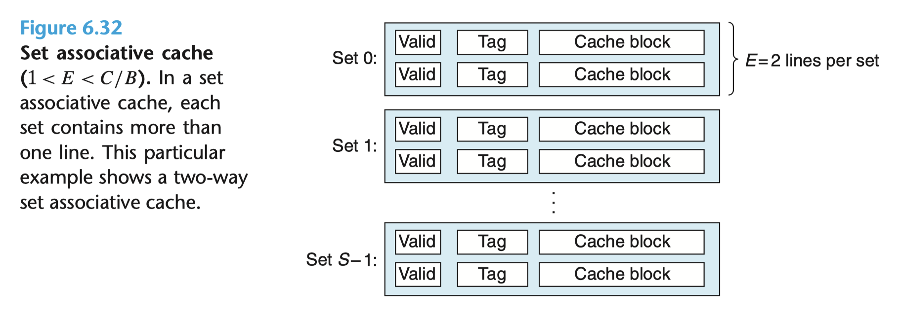
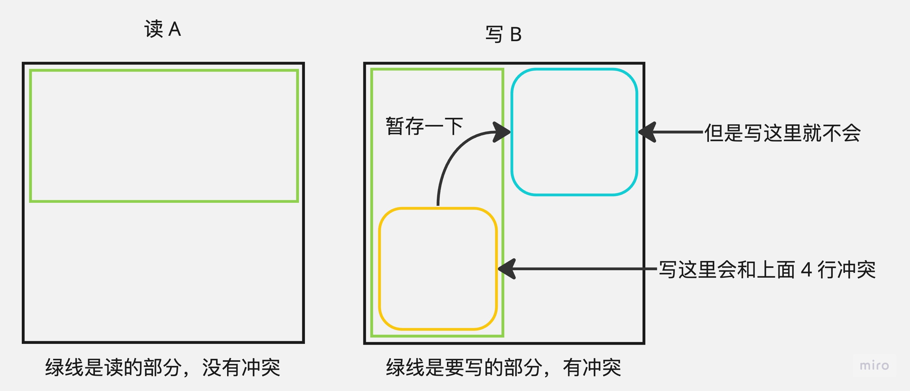

# 更适合北大宝宝体质的 Cache Lab 踩坑记

## PartA

需要编写一个 `csim.c` 程序，来模拟缓存机制。

### 测试指令

```bash
make && ./test-csim
```

出现 `TEST_CSIM_RESULTS=27` 字样即代表成功。

### 编写细节

感觉没什么好说的，主要是从汇编回到 C 有点陌生了，注意参数读、文件读和内存分配管理的方法就行。

#### 文件读写

```c
#include <stdlib.h>

FILE* trace_file; // 定义文件指针
trace_file = fopen(optarg, "r"); // 打开文件
fscanf(trace_file, "%s %lx,%d\n", &operation, &address, &size) == 3; // 读取文件，返回值为成功读取的参数个数
```

`FILE *`：文件指针，指向文件的指针，用于读写文件。

`fopen(const char *path, const char *mode)`：打开文件，返回文件指针。用 `r` 模式打开文件，表示只读。

`fscanf(FILE *stream, const char *format, ...)`：从文件流中读取格式化输入。

-   `%s` 表示字符串
-   `%lx` 表示 16 进制数
-   `%d` 表示十进制数。返回值为成功读取的参数个数，所以这里指定为 3 个。

#### 参数读取

```c
#include <getopt.h> // getopt
#include <stdlib.h> // atoi

int main(int argc, char* argv[]) {
    int option;
    while ((option = getopt(argc, argv, "hvs:E:b:t:")) != -1) {
        switch (option) {
        case 'h':
            printUsage();
            exit(0);
        case 'v':
            v = 1;
            break;
        case 's':
            s = atoi(optarg); // 外部变量 optarg 指向当前选项参数的指针，atoi将字符串转换为整数
            break;
        case 'E':
            E = atoi(optarg);
            break;
        case 'b':
            b = atoi(optarg);
            break;
        case 't':
            trace_file = fopen(optarg, "r");
            break;
        default:
            printUsage();
            exit(0);
        }
    }
}
```

`getopt(int argc, char * const argv[], const char *optstring)`：解析命令行参数。

-   `argc` 表示参数个数
-   `argv` 表示参数列表
-   `optstring` 表示选项字符串，选项字符串中的字母表示选项，冒号表示选项后面需要参数（必填）。返回值为当前选项字母，如果没有选项了则返回 -1。

> 在本例中，选项字符串为 `hvs:E:b:t:`，表示有 5 个选项，其中 `s`、`E`、`b`、`t` 后面需要参数。`h`、`v` 后面不需要参数。
>
> 关于 `optarg`，可以理解为是用来保存选项的参数的，而且虽然你没有定义它，但是因为你引入了 `getopt.h` 头文件，所以它是一个外部变量，你可以直接使用它。
>
> 本次测评不要求 `h` 和 `v` 选项，所以你也可以用 `s:E:b:t:` 作为选项字符串（当然后面的逻辑也要对应修改）。

`atoi(const char *nptr)`：将字符串转换为整数。

#### 内存分配管理



> 注：附图来自英文原版 CSAPP 3rd P661 Figure 6.32

```c
struct line {
    int valid; // 有效位
    int tag; // 标记
    int last_used_time; // 最后使用时间
}; // 字节信息是没用的，不用存

// 定义组，每个组有 E 个行
typedef struct line* set;

// 定义缓存，有 S 个组
set* cache;

// 初始化缓存
cache = (set*)malloc(sizeof(set) * (1 << s));
for (int i = 0; i < (1 << s); i++) {
    cache[i] = (set)malloc(sizeof(struct line) * E);
    for (int j = 0; j < E; j++) {
        cache[i][j].valid = -1;
        cache[i][j].tag = -1;
        cache[i][j].last_used_time = -1;
    }
}
```

注意结构体使用 `sizeof` 时，要加上 `struct` 关键字。

cache 是一个 set 数组，每个 set 有 E 个 line，每个 line 有 3 个参数，分别是 valid、tag 和 last_used_time。

因而 cache 的类型是 `set*`，即指向 set 的指针，而 set 的类型是 `line*`，即指向 line 的指针。

> `malloc` 和 `calloc` 都是动态分配内存的函数，`malloc` 只分配内存，`calloc` 分配内存并初始化为 0。`malloc` 的参数为分配的字节数，`calloc` 的参数为分配的个数和每个元素的字节数。

别忘了最后释放内存：

```c
free(cache);
```

### 踩坑

#### Modify 跳转技巧

Modify 修改操作 = Load 加载操作 + Store 存储操作，所以在 `M` 操作时，需要访问两次缓存。

你编写的程序不用支持 `-v` 参数，所以你可以使用如下的跳转表：

```c
switch (operation) {
case 'I':
    continue;
case 'M': // Modify = Load + Store
    useCache(address);
case 'L': // Load
case 'S': // Store
    useCache(address);
}
```

这种写法可以让 `M` 操作直接多执行一次 `useCache` 函数，而不用再写一遍。但是，如果你想追求效率（尽管这个 Part 并不要求）或者想要支持 `-v` 参数，那么你可以直接多给 `useCache` 传递一个 `is_modify` 参数，来判断是否为 `M` 操作。若是，则可以直接令第二次写为 HIT，而不用再次访问缓存。具体实现可以参考我的代码。

值得一提的是，在所有的测试样例中，只有 `mem.trace` 中存在 `M` 操作，而 handout 中给出的测试命令行均没有测试它，也就没有测试 `M` 操作的正确性。你必须使用 `test-csim` 来测试 `M` 操作的正确性。

#### 地址是 64 位，而不是 32 位

在 `csim.c` 中，地址是 64 位的，而不是 32 位的。所以你需要使用 `%lx` 来读取地址。同时你不能使用 int 类型来存储地址，而应该使用 `unsigned long` 或者 `__uint64_t` 类型或者 `size_t` 类型（执行的机器是 64 位的）。

另外注意对取地址时，一定要注意是否设置了对于高位（tag 位）的掩码，否则可能会出现段错误（数组越界了）。

```c
int set_pos = address >> b & ((1 << s) - 1);
```

#### LRU（Least Recently Used）算法

初始化一个 line 的时候，也许将 `last_used_time` 初始化为 -1 会更好（区别于初始的 timestamp = 0）。因为这样可以判断这个 line 是否被使用过（即判断是否为冷不命中，决定是否要给 eviction 加一）。

在每次执行 `useCache` 的时候，让 `timestamp` 加一，即可维护一个时间戳（而不用使用什么标准库的时间戳，那样会导致两个问题，一个是可能精度不够（每次执行 `useCache` 的时间间隔可能太短），另一个是可能还要处理浮点数问题）。

同时，在遍历一个组的时候，你可以合并遍历和查找最小时间戳的操作，这样可以减少一次遍历。

#### 其他

`printSummary()` 函数定义在 `cachelab.h` 中，所以你需要在 `csim.c` 中引入 `cachelab.h` 头文件。

`puts` 和 `printf` 函数都可以用来输出字符串，但是 `puts` 函数会自动在字符串后面加上换行符，而 `printf` 函数不会。

```c
#include "cachelab.h"

printSummary(hit, miss, eviction);
```

#### 如何理解地址的缓存

我的理解是，对于原本标记 “在内存中的地址（一串 64 位十六进制数）”，通过拆分出 Tag/Set/Byte 这三段，映射到了缓存中的唯一地方（类似于一个哈希函数，大范围到小范围，但是保证了一定的局部性）。当然，映射时就会出现类似冲突 / 驱逐（类似哈希冲突，本质是小范围映射会损失，无法真的不冲突地放下所有的大范围地址）的问题。

### 成品代码

```c
// Arthals 2110306206@stu.pku.edu.cn
// File    : csim.c
// Time    : 2023-11-03 09:06:08
// Author  : Arthals
// Software: Visual Studio Code

#include <stdio.h>
#include <getopt.h>
#include <stdlib.h>
#include "cachelab.h"

struct line {
    int valid;
    int tag;
    int last_used_time;
};

// 定义组，每个组有 E 个行
typedef struct line* set;

// 定义缓存，有 S 个组
set* cache;

// 定义全局缓存参数
int v = 0, s, E, b, t, timestamp = 0;

// 定义全局返回参数
unsigned hit = 0, miss = 0, eviction = 0;

void printUsage() {
    puts("Usage: ./csim [-hv] -s <num> -E <num> -b <num> -t <file>");
    puts("Options:");
    puts("  -h         Print this help message.");
    puts("  -v         Optional verbose flag.");
    puts("  -s <num>   Number of set index bits.");
    puts("  -E <num>   Number of lines per set.");
    puts("  -b <num>   Number of block offset bits.");
    puts("  -t <file>  Trace file.");
    puts("");
    puts("Examples:");
    puts("  linux>  ./csim -s 4 -E 1 -b 4 -t traces/yi.trace");
    puts("  linux>  ./csim -v -s 8 -E 2 -b 4 -t traces/yi.trace");
}

void useCache(size_t address, int is_modify) {
    int set_pos = address >> b & ((1 << s) - 1);
    int tag = address >> (b + s);

    set cur_set = cache[set_pos];
    int lru_pos = 0, lru_time = cur_set[0].last_used_time;


    for (int i = 0;i < E;++i) {
        if (cur_set[i].tag == tag) {
            ++hit;
            // 如果是修改操作，那么还有一次写，会加一次命中（已被加载）
            hit += is_modify;
            cur_set[i].last_used_time = timestamp;
            if (v) {
                printf("hit\n");
            }
            return;
        }
        if (cur_set[i].last_used_time < lru_time) {
            lru_time = cur_set[i].last_used_time;
            lru_pos = i;
        }
    }
    ++miss;
    // 修改操作时，还有写的一次命中（已驱逐后加载）
    hit += is_modify;
    // 冷不命中
    eviction += (lru_time != -1);
    if (v) {
        if (lru_time != -1) {
            if (is_modify)
                printf("miss eviction hit\n");
            else
                printf("miss eviction\n");
        }
        else {
            printf("miss\n");
        }
    }
    // 驱逐
    cur_set[lru_pos].last_used_time = timestamp;
    cur_set[lru_pos].tag = tag;
    return;
}

int main(int argc, char* argv[]) {
    int option;
    FILE* trace_file;
    // 获取参数
    if (argc == 1) {
        printUsage();
        exit(0);
    }
    // 读取参数
    while ((option = getopt(argc, argv, "hvs:E:b:t:")) != -1) {
        switch (option) {
        case 'h':
            printUsage();
            exit(0);
        case 'v':
            v = 1;
            break;
        case 's':
            s = atoi(optarg); // 外部变量 optarg 指向当前选项参数的指针，stdlib::atoi将字符串转换为整数
            break;
        case 'E':
            E = atoi(optarg);
            break;
        case 'b':
            b = atoi(optarg);
            break;
        case 't':
            trace_file = fopen(optarg, "r");
            break;
        default:
            printUsage();
            exit(0);
        }
    }

    // 校验参数
    if (s <= 0 || E <= 0 || b <= 0 || s + b > 64 || trace_file == NULL) {
        printUsage();
        exit(1);
    }

    // 设置校验位数，发现没用到，遂注释
    // t = 64 - s - b;

    // 初始化缓存
    cache = (set*)malloc(sizeof(set) * (1 << s));
    for (int i = 0; i < (1 << s); i++) {
        cache[i] = (set)malloc(sizeof(struct line) * E);
        for (int j = 0; j < E; j++) {
            cache[i][j].valid = -1;
            cache[i][j].tag = -1;
            cache[i][j].last_used_time = -1;
        }
    }

    // S 38c08c, 1
    // L 30c080, 4
    // M 30c080, 4

    int size;
    char operation;
    size_t address;

    while (fscanf(trace_file, "%s %lx,%d\n", &operation, &address, &size) == 3) {
        ++timestamp;
        if (v) {
            printf("%c %lx,%d ", operation, address, size);
        }
        switch (operation) {
        case 'I':
            continue;
        case 'M': // Modify = Load + Store
            useCache(address, 1);
            break;
        case 'L': // Load
        case 'S': // Store
            useCache(address, 0);
        }
    }

    free(cache);
    printSummary(hit, miss, eviction);
}

```

运行：

```bash
make && ./test-csim
```

得到：

```text
                        Your simulator     Reference simulator
Points (s,E,b)    Hits  Misses  Evicts    Hits  Misses  Evicts
     3 (1,1,1)       9       8       6       9       8       6  traces/yi2.trace
     3 (4,2,4)       4       5       2       4       5       2  traces/yi.trace
     3 (2,1,4)       2       3       1       2       3       1  traces/dave.trace
     3 (2,1,3)     694     453     449     694     453     449  traces/mem.trace
     3 (2,2,3)     201      37      29     201      37      29  traces/trans.trace
     3 (2,4,3)     212      26      10     212      26      10  traces/trans.trace
     3 (5,1,5)     231       7       0     231       7       0  traces/trans.trace
     6 (5,1,5)  265189   21777   21745  265189   21777   21745  traces/long.trace
    27

TEST_CSIM_RESULTS=27
```

大功告成！

## PartB

缓存参数：`s = 5, E = 1, b = 5`。

所以这是一个有 32 个组（$ S = 2^s = 32 $）的直接映射高速缓存（$ E = 1 $），每个组只有 1 个块，每个块有 32 个字节（$ B = 2^b = 32 $）。

也就是说，一共可以放得下 1024 个字节，即 256 个 int。

### 32x32

测试指令：

```bash
make && ./test-trans -M 32 -N 32
```

满分线：misses <= 300。

观察到示例转置函数的结果：`hits:869, misses:1184, evictions:1152`

显然这是极差的，因为 A 和 B 的大小一致，而且存储的地址偏差正好使得其对应位置的数据都在同一个组（行 / 块）中（初始地址相同，因而每 8 个 int 恰被映射到同一个 Set/Block）。

以下讨论何时会出现冲突。考虑默认程序，我们总是需要将 `A[i][j]` 读出、转置、写到 `B[j][i]`。

因而，我们需要考虑他们各自在上级缓存中的位置。你可以认为行优先读时，每 8 个连续的字节总是映射到同一个 Set/Block（即 `A[i][8k+0]` ~ `A[i][8k+7]`）。对 B 同理。

我们发现，直接按元素写的时候，实际不命中高达 1184 次，如果每个读写都造成两次不命中显然不止这么点，那么什么时候会命中？

-   对于读 A 操作来说，我们往往具有很好的局部性，因为是行优先读，所以每 8 个数，除了第一次加载，后面的 7 次都会命中。
-   对于写 B 操作来说，我们完全没有利用局部性。考虑我们写 B 的第 j 行，我们第一次写（`B[j][0]`）和第二次写（`B[j][1]`）之间至少包括了对 B 的一整列（32 行，`B[0][0]` ~ `B[31][0]`）的全部写，而我们的缓存大小只有 256 个数的大小（即 8 行），当前行早就被刷掉了，所以我们写 B 完全没机会出现命中。而且在对角线处时，我们还会因为要写 B 而导致对于已经读入的 A 的行发生冲突不命中（即要发生一次驱逐）。

所以整体计算下来，应当发生 1024（写 B 全部不命中）+ 4（写 A 每行每 8 个数不命中一次）\* 32（写 A 的行）+ 32（对角线处写 B 造成读 A 驱逐，需要重新读一次），即 1184 次不命中。

> 此处写这么细，是因为后续处理别的尺寸的时候也可以进行类似的推导。

调用 `csim-ref` 来查看 trace：

```bash
./csim-ref -v -s 5 -E 1 -b 5 -t trace.f1 > trace.f1.v
```

果不其然，有大量的 miss：

```md
L 10e0c0,4 miss
S 14e4a0,4 miss eviction
L 10e0c4,4 hit
S 14e520,4 miss eviction
L 10e0c8,4 hit
S 14e5a0,4 miss eviction
L 10e0cc,4 hit
S 14e620,4 miss eviction
L 10e0d0,4 hit
S 14e6a0,4 miss eviction
L 10e0d4,4 hit
S 14e720,4 miss eviction
L 10e0d8,4 hit
S 14e7a0,4 miss eviction
L 10e0dc,4 hit
S 14e820,4 miss eviction
L 10e0e0,4 miss eviction
S 14e8a0,4 miss eviction
```

于是，我们要利用书上讲过的分块技巧，将 32x32 的矩阵分成 8x8 的小块（依旧记分完后的 4x4 矩阵为 α、β），这样就可以充分利用局部性，读 A 一次连续读入 8 个元素，然后转置，再连续写入 B。即避免了对于写 B 时，因为列优先顺序写造成的缓存驱逐。

同时我们使用多个局部变量来存储从 A 读出来的数据，这样可以最大化地利用局部性。不这么做的话，在对角线块 `α[i][i]` 和 `β[i][i]` 上依旧会导致额外的冲突。

```c
void transpose_submit(int M, int N, int A[N][M], int B[M][N]) {
    REQUIRES(M > 0);
    REQUIRES(N > 0);
    // s = 5, E = 1, b = 5
    // 总变量：4 个循环变量 + 8 个临时变量 = 12 个变量
    int a, b, c, d, e, f, g, h;

    if (M == 32) {
        // 先把 A 复制 B，再转置 B，避免因为 A 的下一次读驱逐 B 的同一行，导致 B 的下一次写 MISS
        // 8*8 分块
        // 总 MISS：16(块数)*[8(读)+8(写)] = 256
        // 显示 MISS =  260，但是通过添加 trans() 的代码并清空缓存，然后对比测试差异，可知实际只有 256 个 MISS
        // 故猜测那 4 个多的 MISS 可能是别的函数调用所致，也可通过观察 trace.f0 发现确实开头多了 1 个 S 和 3 个 L
        for (int i = 0; i < N; i += 8) { // 当前行
            for (int j = 0; j < M; j += 8) { // 当前列
                // 首先将 A[i][j]~A[i+7][j+7] 复制到 B[j][i]~B[j+7][i+7]
                for (int k = 0;k < 8;++k) {
                    a = A[i + k][j];
                    b = A[i + k][j + 1];
                    c = A[i + k][j + 2];
                    d = A[i + k][j + 3];
                    e = A[i + k][j + 4];
                    f = A[i + k][j + 5];
                    g = A[i + k][j + 6];
                    h = A[i + k][j + 7];
                    B[j][i + k] = a;
                    B[j + 1][i + k] = b;
                    B[j + 2][i + k] = c;
                    B[j + 3][i + k] = d;
                    B[j + 4][i + k] = e;
                    B[j + 5][i + k] = f;
                    B[j + 6][i + k] = g;
                    B[j + 7][i + k] = h;
                }
            }
        }
    }
    ENSURES(is_transpose(M, N, A, B));
}
```

运行：

```bash
make && ./test-trans -M 32 -N 32
```

得到：

```md
func 0 (Transpose submission): hits:1765, misses:288, evictions:256
```

可以发现我们已经将 miss 降低到了 288，小于 300 的满分限，收获满分！

但是，这就是完美无缺的吗？显然不是，我们可以继续优化。

注意到理论最优 MISS 数应当是 `16(块数) * [8(读A)+8(写B)] = 256` 次，为什么会多出来 32 次呢？

这是因为当 i=j 时，`A[i][i]` 和 `B[i][i]` 的组数是一样的，所以每次对角线上会额外出现 8 次 MISS：

1.  写 B 的第 i 列，导致 A 的第 i+1 行被驱逐
2.  读 A 的第 i+1 行，导致 B 的第 i+1 列被驱逐
3.  写 B 的第 i+1 列，冲突不命中
4.  ...

有没有什么优化方法呢？当然是有的，我们可以先将 A 的一个块完整、不转置地复制到 B，然后再转置 B，这样对 B 的转置与写时，因为 B 已经完全加载到了缓存中，所以不会出现任何的不命中。

```c
void transpose_submit(int M, int N, int A[N][M], int B[M][N]) {
    REQUIRES(M > 0);
    REQUIRES(N > 0);
    // s = 5, E = 1, b = 5
    // 总变量：4 个循环变量 + 8 个临时变量 = 12 个变量
    int a, b, c, d, e, f, g, h;

    if (M == 32) {
        // 先把 A 复制 B，再转置 B，避免因为 A 的下一次读驱逐 B 的同一行，导致 B 的下一次写 MISS
        // 8*8 分块
        // 总 MISS：16(块数)*[8(读)+8(写)] = 256
        // 显示 MISS =  260，但是通过添加 trans() 的代码并清空缓存，然后对比测试差异，可知实际只有 256 个 MISS
        // 故猜测那 4 个多的 MISS 可能是别的函数调用所致，也可通过观察 trace.f0 发现确实开头多了 1 个 S 和 3 个 L
        for (int i = 0; i < N; i += 8) { // 当前行
            for (int j = 0; j < M; j += 8) { // 当前列
                // 首先将 A[i][j]~A[i+7][j+7] 复制到 B[j][i]~B[j+7][i+7]
                for (int k = 0;k < 8;++k) {
                    a = A[i + k][j];
                    b = A[i + k][j + 1];
                    c = A[i + k][j + 2];
                    d = A[i + k][j + 3];
                    e = A[i + k][j + 4];
                    f = A[i + k][j + 5];
                    g = A[i + k][j + 6];
                    h = A[i + k][j + 7];
                    B[j + k][i] = a;
                    B[j + k][i + 1] = b;
                    B[j + k][i + 2] = c;
                    B[j + k][i + 3] = d;
                    B[j + k][i + 4] = e;
                    B[j + k][i + 5] = f;
                    B[j + k][i + 6] = g;
                    B[j + k][i + 7] = h;
                }
                // 转置 B
                for (int k = 0;k < 8;++k) {
                    // 对角线不用交换
                    for (int l = 0;l < k;++l) {
                        a = B[j + k][i + l];
                        B[j + k][i + l] = B[j + l][i + k];
                        B[j + l][i + k] = a;
                    }
                }
            }
        }
    }
    ENSURES(is_transpose(M, N, A, B));
}
```

运行：

```bash
make && ./test-trans -M 32 -N 32
```

得到：

```md
Summary for official submission (func 0): correctness=1 misses=260
```

可以发现我们已经将 miss 降低到了 260，非常接近理论值 256 了，而经过测试，这 4 个多出来的 MISS 其实函数调用所致。

### 64x64

测试指令：

```bash
make && ./test-trans -M 64 -N 64
```

满分线：misses <= 1300。

首先，我们直接使用 32x32 中的代码：

```c
if (M == 32 || M==64){...}
```

得到输出：

```md
Summary for official submission (func 0): correctness=1 misses=3332
```

发现 miss 过多，这是为什么呢？

回忆一下我们的 cache 参数：`s = 5, E = 1, b = 5`，即 block 有 32 个字节（存 4 个 int） ，32 个组，每个组只有 1 个行。所以我们的缓存总容量是 256 个 int，而 64x64 的矩阵 4 行即可占用 256 个 int，所以我们 8x8 分块后，上半块和下半块的数据会发生冲突不命中，换句话说，就是读 `A[i][0]` 和 `A[i+4][0]` 时会造成冲突不命中，写 B 同理。

如果直接修改代码改成 4x4 分块，我们的确就可以解决这个问题：

```c
if (M == 64) {
    for (int i = 0; i < N; i += 4) { // 当前行
        for (int j = 0; j < M; j += 4) { // 当前列
            // 首先将 A[i][j]~A[i+3][j+3] 复制到 B[j][i]~B[j+3][i+3]

            for (int k = 0;k < 4;++k) {
                a = A[i + k][j];
                b = A[i + k][j + 1];
                c = A[i + k][j + 2];
                d = A[i + k][j + 3];
                B[j + k][i] = a;
                B[j + k][i + 1] = b;
                B[j + k][i + 2] = c;
                B[j + k][i + 3] = d;
            }
            // 转置 B
            for (int k = 0;k < 4;++k) {
                // 对角线不用交换
                for (int l = 0;l < k;++l) {
                    a = B[j + k][i + l];
                    B[j + k][i + l] = B[j + l][i + k];
                    B[j + l][i + k] = a;
                }
            }
        }
    }
}
```

运行：

```bash
make && ./test-trans -M 64 -N 64
```

得到：

```md
Summary for official submission (func 0): correctness=1 misses=1604
```

收获了 4.5 分，但是仍然不够理想。

注意这里不能采用 4x8 分块，因为这样虽然可以避免 A 矩阵的读的冲突不命中，但是 B 矩阵的写的冲突不命中仍然存在。

不过这也启发了我们，既然可以通过 4x8 分块首先避免对于 A 矩阵的读的冲突不命中，那么 B 矩阵的写的冲突不命中是不是可以通过 “暂时性” 地将后 4 个元素先放到同一行的块里来避免呢？



于是我们得到了优化思路：既然直接 8x8 分块不行，那我们就先 8x8 分大块，再在每个大块内 4x4 地分小块，然后注意，读完 A 的第一行（8 个 int）后，我们将前 4 个正常转置并写入 B，然后将后 4 个先放到一个暂时存储块中，这样就可以避免写下半块时的冲突不命中了。

考虑 `α[2][2]`、`β[2][2]` 为 A、B 8x8 分块之后的矩阵再进行 4x4 分块得到的子矩阵，其每个元素都是 4x4 个 int 。

以下所有代码说明，建议参照 [ NFLS-CHINA / CSAPP - Cache Lab 的更(最)优秀的解法 ](https://zhuanlan.zhihu.com/p/387662272) 一文的图片对照着看，我相信你会有更好的理解。

```c
for (int i = 0; i < N; i += 8) { // 当前行
    for (int j = 0; j < M; j += 8) { // 当前列
        // 先复制
        for (int k = 0;k < 4;++k) {
            // 从 A 中取 α[0][0]+α[0][1]的第 k 行，执行 4 次，即读出 A 的上半块，每次循环，读 A 都必然 MISS
            // 所以总计 4 次 MISS。
            a = A[i + k][j];
            b = A[i + k][j + 1];
            c = A[i + k][j + 2];
            d = A[i + k][j + 3];
            e = A[i + k][j + 4];
            f = A[i + k][j + 5];
            g = A[i + k][j + 6];
            h = A[i + k][j + 7];
            // 转置前四个数到 β[0][0] 的第 k 列，4 次 MISS
            // 若 i=j 还会因为上一步读 A 造成冲突不命中，所以额外造成 3 次冲突不命中。
            B[j][i + k] = a;
            B[j + 1][i + k] = b;
            B[j + 2][i + k] = c;
            B[j + 3][i + k] = d;
            // 将后四个转置后，先复制到 β[0][1] 的第 k 列
            // 可以避免此时去写 β[1][0] 的冲突不命中
            B[j][i + k + 4] = e;
            B[j + 1][i + k + 4] = f;
            B[j + 2][i + k + 4] = g;
            B[j + 3][i + k + 4] = h;
        }
    }
}
```

-   对于 i ≠ j：4 + 4 = 8 次 MISS
-   对于 i = j: 4 + 4 + 3 = 11 次 MISS

此时，已经转置完毕 `β[0][0]`（左上矩阵），而转置好的 `β[1][0]`（左下矩阵）暂时位于 `β[0][1]`（右上矩阵）。

同时，A 的前四行已经完全被读完并用完了。所以我们可以放心的开始读 A 的后四行了。

```c
// 此时，已经转置完毕 β[0][0]
// 转置好的 β[1][0] 位于 β[0][1]

// 移动 β[0][1] 到 β[1][0]
// 同时将 α[1][0] 复制并转置到 β[0][1]

for (int k = 0;k < 4;++k) {
    // 读 α[1][0] 的第 k 列，首次循环造成 4 次 MISS，后续循环均 HIT
    // 对于 i=j 时，因为循环间读 B （见下一步，位于上半块）会造成 1 次冲突不命中，原有的一行缓存被驱逐
    // 所以总计造成 4 / 7 次 MISS
    e = A[i + 4][j + k];
    f = A[i + 5][j + k];
    g = A[i + 6][j + k];
    h = A[i + 7][j + k];
    // 复制 β[0][1] 的第 k 行，一定是行优先读，否则写的时候会出现额外的冲突不命中
    // 若 i ≠ j 时因为上一部分最后写了这里，所以全部命中
    // 若 i=j，每次循环都会因为上一步读 A 造成了冲突不命中，所以每次循环 1 次 MISS，总计 4 次 MISS
    // 所以总计造成 0 / 4 次 MISS
    a = B[j + k][i + 4];
    b = B[j + k][i + 5];
    c = B[j + k][i + 6];
    d = B[j + k][i + 7];
    // 将 α[1][0] 的第 k 列复制到 β[0][1] 的第 k 行，因为上一步读的时候已经完成缓存，所以写的时候不会 MISS
    B[j + k][i + 4] = e;
    B[j + k][i + 5] = f;
    B[j + k][i + 6] = g;
    B[j + k][i + 7] = h;
    // 将 β[0][1] 的第 k 行复制到 β[1][0] 的第 k 行
    // 注意你这里是按行读写的，所以对于所有情况，每次循环造成 1 次冲突不命中（上一步读上半块了，一定没缓存了）
    // 所以总计造成 4 次 MISS
    B[j + k + 4][i] = a;
    B[j + k + 4][i + 1] = b;
    B[j + k + 4][i + 2] = c;
    B[j + k + 4][i + 3] = d;
}
```

这里我们已经将 `β[1][0]`（左下矩阵）交换回正确的位置，以及转置了 `β[0][1]`（右上矩阵）。

-   对于 i ≠ j：4 + 4 = 8 次 MISS
-   对于 i = j: 7 + 4 + 4 = 15 次 MISS

注意我们先读 A 再读 B，这里也可以先读 B 再读 A ，两者没有区别。我原以为，读 `β[0][1]`（右上矩阵）（实际上存的是 `β[1][0]`（左下矩阵）） 接写 `β[0][1]`（右上矩阵）可以避免 MISS，但实际测试无影响。读者可以思考一下是为什么。

而 `β[1][1]`（右下矩阵）仍然没做操作，我们使用类似 32x32 中的先复制再转置的方法，将 `β[1][1]`（右下矩阵）转置好。

```c
// 复制 α[1][1] 到 β[1][1]
// 依旧是先复制再转置以避免冲突不命中
// 若 i≠j，完全没有 MISS，因为 A、B 均在上个部分被读入缓存
// 若 i=j，因为上一部分最后是写 B 的最后一行，但是其他行都是正常的，所以读 A 时会出现 1 次冲突不命中，
// 读完 A 写 B 时，必定出现冲突不命中，每次循环 1 次 MISS
// 所以总计造成 0 / 5 次 MISS
for (int k = 4;k < 8;++k) {
    a = A[i + k][j + 4];
    b = A[i + k][j + 5];
    c = A[i + k][j + 6];
    d = A[i + k][j + 7];
    B[j + k][i + 4] = a;
    B[j + k][i + 5] = b;
    B[j + k][i + 6] = c;
    B[j + k][i + 7] = d;
}
// 转置 β[1][1]
// 全部 HIT
for (int k = 4;k < 8;++k) {
    // 对角线不用交换
    for (int l = 4;l < k;++l) {
        a = B[j + k][i + l];
        B[j + k][i + l] = B[j + l][i + k];
        B[j + l][i + k] = a;
    }
}
```

-   对于 i ≠ j：0 次 MISS
-   对于 i = j：5 次 MISS

最终，我们得到了满分的代码：

```c
if (M == 64) {
    // 因为每个 8*8 分块中，上半块和下半块会冲突不命中，所以再把每个 8*8 分块分成 4 个 4*4 分块
    // 然后通过暂时性存储 β[1][0]（左下块） 到 β[0][1]（右上块） 来避免冲突不命中
    // 若直接写到 β[1][0]（左下块），则会写 B 的上半块（4*8) 和下半块（4*8) 时出现冲突不命中
    // 特别的，对于 i=j 的情况，还是会出现冲突不命中，因为 A 本身和 B 就是冲突的
    // 计算出的总 MISS 数为 (8+8)*56+(11+15+5)*8 = 1144 次，但是实际是 1148 次，应该又是程序调用的问题
    for (int i = 0; i < N; i += 8) { // 当前行
        for (int j = 0; j < M; j += 8) { // 当前列
            // 先复制
            for (int k = 0;k < 4;++k) {
                // 从 A 中取 α[0][0]+α[0][1]的第 k 行，执行 4 次，即读出 A 的上半块，每次循环，读 A 都必然 MISS
                // 所以总计 4 次 MISS。
                a = A[i + k][j];
                b = A[i + k][j + 1];
                c = A[i + k][j + 2];
                d = A[i + k][j + 3];
                e = A[i + k][j + 4];
                f = A[i + k][j + 5];
                g = A[i + k][j + 6];
                h = A[i + k][j + 7];
                // 转置前四个数到 β[0][0] 的第 k 列，4 次 MISS
                // 若 i=j 还会因为上一步读 A 造成冲突不命中，所以额外造成 3 次冲突不命中。
                B[j][i + k] = a;
                B[j + 1][i + k] = b;
                B[j + 2][i + k] = c;
                B[j + 3][i + k] = d;
                // 将后四个转置后，先复制到 β[0][1] 的第 k 列
                // 可以避免此时去写 β[1][0] 的冲突不命中
                B[j][i + k + 4] = e;
                B[j + 1][i + k + 4] = f;
                B[j + 2][i + k + 4] = g;
                B[j + 3][i + k + 4] = h;
            }
            // 此时，已经转置完毕 β[0][0]
            // 转置好的 β[1][0] 位于 β[0][1]
            // * 对于 i ≠ j：4 + 4 = 8 次 MISS
            // * 对于 i = j: 4 + 4 + 3 = 11 次 MISS

            // ------- //

            // 移动 β[0][1] 到 β[1][0]
            // 同时将 α[1][0] 复制并转置到 β[0][1]

            for (int k = 0;k < 4;++k) {
                // 读 α[1][0] 的第 k 列，首次循环造成 4 次 MISS，后续循环均 HIT
                // 对于 i=j 时，因为循环间读 B （见下一步，位于上半块）会造成 1 次冲突不命中，原有的一行缓存被驱逐
                // 所以总计造成 4 / 7 次 MISS
                e = A[i + 4][j + k];
                f = A[i + 5][j + k];
                g = A[i + 6][j + k];
                h = A[i + 7][j + k];
                // 复制 β[0][1] 的第 k 行，一定是行优先读，否则写的时候会出现额外的冲突不命中
                // 若 i ≠ j 时因为上一部分最后写了这里，所以全部命中
                // 若 i=j，每次循环都会因为上一步读 A 造成了冲突不命中，所以每次循环 1 次 MISS，总计 4 次 MISS
                // 所以总计造成 0 / 4 次 MISS
                a = B[j + k][i + 4];
                b = B[j + k][i + 5];
                c = B[j + k][i + 6];
                d = B[j + k][i + 7];
                // 将 α[1][0] 的第 k 列复制到 β[0][1] 的第 k 行，因为上一步读的时候已经完成缓存，所以写的时候不会 MISS
                B[j + k][i + 4] = e;
                B[j + k][i + 5] = f;
                B[j + k][i + 6] = g;
                B[j + k][i + 7] = h;
                // 将 β[0][1] 的第 k 行复制到 β[1][0] 的第 k 行
                // 注意你这里是按行读写的，所以对于所有情况，每次循环造成 1 次冲突不命中（上一步读上半块了，一定没缓存了）
                // 所以总计造成 4 次 MISS
                B[j + k + 4][i] = a;
                B[j + k + 4][i + 1] = b;
                B[j + k + 4][i + 2] = c;
                B[j + k + 4][i + 3] = d;
            }
            // 这里我们已经将 β[1][0]（左下矩阵）交换回正确的位置，以及转置了 β[0][1]（右上矩阵）。
            // * 对于 i ≠ j：4 + 4 = 8 次 MISS
            // * 对于 i = j: 7 + 4 + 4 = 15 次 MISS

            // ------- //

            // 复制 α[1][1] 到 β[1][1]
            // 依旧是先复制再转置以避免冲突不命中
            // 若 i≠j，完全没有 MISS，因为 A、B 均在上个部分被读入缓存
            // 若 i=j，因为上一部分最后是写 B 的最后一行，但是其他行都是正常的，所以读 A 时会出现 1 次冲突不命中，
            // 读完 A 写 B 时，必定出现冲突不命中，每次循环 1 次 MISS
            // 所以总计造成 0 / 5 次 MISS
            for (int k = 4;k < 8;++k) {
                a = A[i + k][j + 4];
                b = A[i + k][j + 5];
                c = A[i + k][j + 6];
                d = A[i + k][j + 7];
                B[j + k][i + 4] = a;
                B[j + k][i + 5] = b;
                B[j + k][i + 6] = c;
                B[j + k][i + 7] = d;
            }
            // 转置 β[1][1]
            // 全部 HIT
            for (int k = 4;k < 8;++k) {
                // 对角线不用交换
                for (int l = 4;l < k;++l) {
                    a = B[j + k][i + l];
                    B[j + k][i + l] = B[j + l][i + k];
                    B[j + l][i + k] = a;
                }
            }
            // * 对于 i ≠ j：0 次 MISS
            // * 对于 i = j：5 次 MISS
        }
    }
}

```

运行：

```bash
make && ./test-trans -M 64 -N 64
```

得到：

```md
Summary for official submission (func 0): correctness=1 misses=1148
```

距离理论最优值 1024（8x8 分块，64 个块，每个块 16 次 miss） 仍然有一定差距，但是已经很接近了，而且已经收获了满分。

如果你想继续优化，显然是要特别处理对角线上的块的，因为他们每次都会出现冲突不命中，所以可以通过先复制到一个临时块这样的方法来避免，这里就不展开了 ~~（才不是懒得卷了）~~。

### 60x68

测试指令：

```bash
make && ./test-trans -M 60 -N 68
```

满分线：misses <= 1600。

首先尝试 4x4 分块：

```c
if (M == 60) {
    for (int i = 0; i < N; i += 4) { // 当前行
        for (int j = 0; j < M; j += 4) { // 当前列
            // 首先将 A[i][j]~A[i+3][j+3] 复制到 B[j][i]~B[j+3][i+3]
            for (int k = 0;k < 4;++k) {
                a = A[i + k][j];
                b = A[i + k][j + 1];
                c = A[i + k][j + 2];
                d = A[i + k][j + 3];
                B[j + k][i] = a;
                B[j + k][i + 1] = b;
                B[j + k][i + 2] = c;
                B[j + k][i + 3] = d;
            }
            // 转置 B
            for (int k = 0;k < 4;++k) {
                // 对角线不用交换
                for (int l = 0;l < k;++l) {
                    a = B[j + k][i + l];
                    B[j + k][i + l] = B[j + l][i + k];
                    B[j + l][i + k] = a;
                }
            }
        }
    }
}

```

运行：

```bash
make && ./test-trans -M 60 -N 68
```

得到：

```md
Summary for official submission (func 0): correctness=1 misses=1623
```

发现似乎已经接近满分了啊？那我们只需要贪心地对大部分地方用 8x8 分块，再用 4x4 分块处理余下的部分就行了：

```c
if (M == 60) {
    // 行列都不整除 8，但正好可以避免冲突不命中
    // 如果直接使用 4x4 分块，总 MISS 数为 1623，已经很接近满分
    // 再次基础上，再贪心拆出一个 8x8 分块，然后用 4x4 解决剩余部分，即可拿到满分
    // 总 MISS：1567
    // 8x8 分块处理 64x56 的部分
    for (int i = 0; i < 64; i += 8) {
        for (int j = 0; j < 56; j += 8) {
            for (int k = 0;k < 8;++k) {
                a = A[i + k][j];
                b = A[i + k][j + 1];
                c = A[i + k][j + 2];
                d = A[i + k][j + 3];
                e = A[i + k][j + 4];
                f = A[i + k][j + 5];
                g = A[i + k][j + 6];
                h = A[i + k][j + 7];
                B[j + k][i] = a;
                B[j + k][i + 1] = b;
                B[j + k][i + 2] = c;
                B[j + k][i + 3] = d;
                B[j + k][i + 4] = e;
                B[j + k][i + 5] = f;
                B[j + k][i + 6] = g;
                B[j + k][i + 7] = h;
            }
            // 转置 B
            for (int k = 0;k < 8;++k) {
                // 对角线不用交换
                for (int l = 0;l < k;++l) {
                    a = B[j + k][i + l];
                    B[j + k][i + l] = B[j + l][i + k];
                    B[j + l][i + k] = a;
                }
            }
        }
    }
    // 4x4 处理剩余部分
    for (int i = 0; i < N; i += 4) {
        for (int j = 56; j < M; j += 4) {
            for (int k = 0;k < 4;++k) {
                a = A[i + k][j];
                b = A[i + k][j + 1];
                c = A[i + k][j + 2];
                d = A[i + k][j + 3];
                B[j + k][i] = a;
                B[j + k][i + 1] = b;
                B[j + k][i + 2] = c;
                B[j + k][i + 3] = d;
            }
            // 转置 B
            for (int k = 0;k < 4;++k) {
                // 对角线不用交换
                for (int l = 0;l < k;++l) {
                    a = B[j + k][i + l];
                    B[j + k][i + l] = B[j + l][i + k];
                    B[j + l][i + k] = a;
                }
            }
        }
    }
    for (int i = 64; i < N; i += 4) {
        for (int j = 0; j < 56; j += 4) {
            for (int k = 0;k < 4;++k) {
                a = A[i + k][j];
                b = A[i + k][j + 1];
                c = A[i + k][j + 2];
                d = A[i + k][j + 3];
                B[j + k][i] = a;
                B[j + k][i + 1] = b;
                B[j + k][i + 2] = c;
                B[j + k][i + 3] = d;
            }
            // 转置 B
            for (int k = 0;k < 4;++k) {
                // 对角线不用交换
                for (int l = 0;l < k;++l) {
                    a = B[j + k][i + l];
                    B[j + k][i + l] = B[j + l][i + k];
                    B[j + l][i + k] = a;
                }
            }
        }
    }
}

```

运行：

```bash
make && ./test-trans -M 60 -N 68
```

得到：

```md
Summary for official submission (func 0): correctness=1 misses=1567
```

完美！下播！

## Handin

首先运行：

```bash
python driver.py
```

得到结果：

```text
Part A: Testing cache simulator
Running ./test-csim
                        Your simulator     Reference simulator
Points (s,E,b)    Hits  Misses  Evicts    Hits  Misses  Evicts
     3 (1,1,1)       9       8       6       9       8       6  traces/yi2.trace
     3 (4,2,4)       4       5       2       4       5       2  traces/yi.trace
     3 (2,1,4)       2       3       1       2       3       1  traces/dave.trace
     3 (2,1,3)     694     453     449     694     453     449  traces/mem.trace
     3 (2,2,3)     201      37      29     201      37      29  traces/trans.trace
     3 (2,4,3)     212      26      10     212      26      10  traces/trans.trace
     3 (5,1,5)     231       7       0     231       7       0  traces/trans.trace
     6 (5,1,5)  265189   21777   21745  265189   21777   21745  traces/long.trace
    27

TEST_CSIM_RESULTS=27

                        Your simulator     Reference simulator
Points (s,E,b)    Hits  Misses  Evicts    Hits  Misses  Evicts
     3 (1,1,1)       9       8       6       9       8       6  traces/yi2.trace
     3 (4,2,4)       4       5       2       4       5       2  traces/yi.trace
     3 (2,1,4)       2       3       1       2       3       1  traces/dave.trace
     3 (2,1,3)     694     453     449     694     453     449  traces/mem.trace
     3 (2,2,3)     201      37      29     201      37      29  traces/trans.trace
     3 (2,4,3)     212      26      10     212      26      10  traces/trans.trace
     3 (5,1,5)     231       7       0     231       7       0  traces/trans.trace
     6 (5,1,5)  265189   21777   21745  265189   21777   21745  traces/long.trace
    27


Part B: Testing transpose function
Running ./test-trans -M 32 -N 32 -t
Running ./test-trans -M 64 -N 64 -t
Running ./test-trans -M 60 -N 68 -t

Cache Lab summary:
                        Points   Max pts      Misses
Csim correctness          27.0        27
Trans perf 32x32           8.0         8         260
Trans perf 64x64           8.0         8        1148
Trans perf 60x68          10.0        10        1567
          Total points    53.0        53
```

注意，这会自动 `make` 并生成 `handin.tar`，改个名交了就行啦！

## Other

一些别的我觉得可能有用的教程：

[ NFLS-CHINA / CSAPP - Cache Lab 的更(最)优秀的解法 ](https://zhuanlan.zhihu.com/p/387662272)：暂存想法的来源，很生动的图示。

[ 孟永康 / 《深入理解计算机系统》配套实验：Cache Lab ](https://zhuanlan.zhihu.com/p/33846811)：很好的解析了为什么尺寸变化会出现冲突。配有测试程序。
