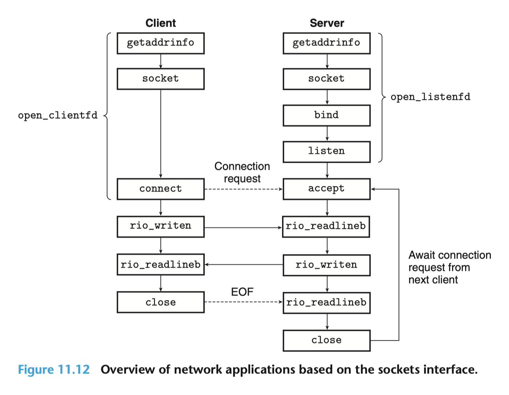

# 更适合北大宝宝体质的 Proxy Lab 踩坑记

Proxy lab 是 ICS 课程的最后一个 lab，其要求我们实现一个 HTTP 代理服务器，从而实现在客户端和服务端之间中介的功能。

这个 lab 看似只需要网络编程这一章的知识，然而实际做起来，其涉及了第三部分（系统级 I/O、网络编程、并发编程）全部的知识。

在这个 lab 中，我们所实现的 HTTP 代理服务器要求至少实现以下功能：

-   实现代理，通过输入参数获取监听端口号并监听，接受客户端的连接请求，建立连接并转发请求到服务端，同时可以接受服务端的响应并转发到客户端，只要求实现 HTTP GET 方法。
-   实现并发，即可以同时处理多个客户端的请求。可以选择基于 I/O 多路复用或者多线程（推荐）实现。
-   实现缓存，即可以缓存服务端的响应，当客户端再次请求时，可以直接从缓存中获取响应并返回给客户端，而不需要再次向服务端请求。缓存替换策略要求实现为 LRU（Least Recently Used，最近最少使用）。

注意，本文的所有配置、指令均以 Ubuntu 环境为例，而且假设你不具有桌面环境，只有纯命令行环境。

## 环境配置

本地测评 Proxy Lab 需要额外安装如下工具（若使用 Class Machine 可以跳过本章）：

-   [Chrome](https://www.google.com/chrome/?platform=linux)：Linux 下的 Chrome 浏览器，选择 `.deb` 格式（Ubuntu / Debian），你可以下载下来使用 ftp 上传，也可以直接在服务器使用命令行安装（注意实际下载 URL 可能会变动，如我们这年 writeup 上给的指令就不可用）。

    ```bash
    wget https://dl.google.com/linux/direct/google-chrome-stable_current_amd64.deb
    sudo dpkg -i google-chrome-stable_current_amd64.deb
    rm google-chrome-stable_current_amd64.deb
    ```

    一定注意要移除 `.deb` 文件，否则 `make handin` 制作上传文件的时候可能会导致打包文件过大，无法上传。

-   [Chrome Driver](https://chromedriver.chromium.org/downloads)：Chrome 浏览器的驱动，用于实现自动化测试。千万要注意你所下载的版本要和 Chrome 版本相匹配，否则会报错。你可以在 [适配性检查网址](https://googlechromelabs.github.io/chrome-for-testing/) 检查适配性、找到对应的下载 URL，然后使用如下命令行安装，注意其中的 URL 可能需要替换，请自行检查：

    ```bash
    wget https://edgedl.me.gvt1.com/edgedl/chrome/chrome-for-testing/120.0.6099.109/linux64/chromedriver-linux64.zip
    unzip chromedriver-linux64.zip
    rm chromedriver-linux64.zip
    sudo mv chromedriver /usr/local/bin/
    ```

    最后一行命令是将 `chromedriver` 移动到 `/usr/local/bin/` 目录（即默认环境变量 `$PATH` 检索的位置）下，这样就可以在任意目录下使用 `chromedriver` 命令用以启动驱动。

-   [Selenium](https://www.selenium.dev/)：Selenium 是一个自动化测试工具，可以用于模拟浏览器行为。如果你之前接触过爬虫，你可能会比较熟悉这个框架。这个框架用以启动测试的 Python 脚本 `webdriver_test.py`，你可以使用如下命令行安装（如果安装不畅，请考虑使用第二行换源指令）：

    ```bash
    pip3 install selenium
    # 使用清华源
    pip3 install selenium -i https://pypi.tuna.tsinghua.edu.cn/simple
    ```

## 测试指令

Proxy lab 实现的是个中介服务器，那么我们怎么对写好的服务器进行测试呢？这就需要我们在远程服务器上再启动一个真实的内容服务器，即 `tiny` 服务器。

```bash
# 编译，不更改工作目录
(cd ./tiny && make clean && make)
# 默认前台运行，推荐使用此法+新建终端方便查看日志
cd ./tiny && ./tiny 7778
# 直接后台运行
cd ./tiny && ./tiny 7778 & cd ..
```

一定要注意， `tiny.c` 在 `./tiny` 目录下，且编译出来的可执行文件也一定要在 `./tiny` 目录下执行，否则会遇到找不到文件的问题。

如上命令使用 `make` 命令编译 `tiny` 服务器（以括号包裹命令，不更改 $PWD 工作目录），然后在 `./tiny` 目录下使用 `./tiny 7778` 命令启动内容服务器，其中 `7778` 是内容服务器端口号，如果已经被占用，你可以自行修改。

另外第三行看似在 `./tiny 7778 &` 和 `cd ..` 之间少了一个 `&&` 连接，但是实际上这反而是正确做法，因为标志后台运行的 `&` 和命令连接的 `&&` 的不能连着同时使用。

正如我们在 Tsh lab 中学到的一样，直接运行一个命令会默认在前台运行，这会导致我们前台进程被占用，此时你可以新开一个终端（推荐，因为可以方便的使用切换终端的方式查看服务器 / 代理服务器的日志输出），或者使用如下指令的搭配：

```bash
Ctrl-Z
jobs
bg %1
fg %1
```

其中：

-   `Ctrl-Z` 会将前台进程挂起（回忆第八章 ECF 的信号一节，这会发送 `SIGTSTP` 信号到前台进程组的每个进程）
-   `jobs` 会显示当前的任务，此处 `1` 就是 `tiny` 的 job 编号。
-   `bg %1` 会将挂起的进程转移到后台运行
-   `fg %1` 会将后台进程转移到前台运行。

其他的方法，则是使用 `pm2` 等进程管理工具来守护进程，随时查看 log，可能会更加方便，但是考虑到对于 Class Machine 并不适用（无法链接外网），这里不再赘述。

而当你新启动一个终端后（或者通过挂起内容服务器重新获得前台执行权限），假设你已经完成了 Proxy Lab 的实现，那么你就可以使用如下指令来启动你的代理服务器：

```bash
# 编译 & 执行
make clean && make && ./proxy 7777 &
```

其中 `7777` 是你的代理服务器的监听端口号，你可以自行修改。

然后，你还是可以通过新建一个终端，或者使用上文提到的进程管理操作，重新获得前台执行。

此时，你就可以使用 `curl` 来使用代理服务器访问内容服务器了：

```bash
# 访问 tiny 服务器
curl -v --proxy http://localhost:7777 http://localhost:7778/
# 访问百度，假定你的代理服务器可以访问外网、不支持 HTTPS
curl -v --proxy http://localhost:7777 http://www.baidu.com/
```

此处还有一个小技巧就是可以使用 VS Code 的端口转发功能，这样你就可以在本地使用 `curl` 命令了。

配好环境、写好代码后，你就可以使用如下测试指令进行自动评测啦：

```bash
make clean && make && ./driver.sh
```

完成了以上的配置，且熟悉了如何使用命令行对你的代理服务器进行测试后，你就可以真正开始你的 Proxy Lab 之旅啦！

## 知识回顾

Proxy Lab 的完成，依赖于我们对于系统级 I/O、网络编程、并发编程这三章知识的掌握。

坦白来讲，完成 Proxy Lab 所需要自己独立实现的代码量极其有限，且几乎都是字符串处理等没有什么技术含量的操作，所以只要你完全的理解了整个代理服务器的工作流程，基于书上给出的两段示例代码，你完全有可能花费比之前的 lab 少很多的时间就能完成这个 lab。

因而，本文会在知识回顾这一节相对多地分配一些笔墨，希望能够帮助你更好的理解书本上的内容，从而又快又好地完成这个 lab。

理解如下这张图，是完成本 lab 的基础。



### 系统级 I/O

系统级 I/O 主要会涉及到 RIO 包的使用，关于 RIO 包，可能很多同学（即使是读完代码后）都会有疑惑，为什么要额外的做一个这样的包来封装系统级 I/O，而不是直接使用系统级 I/O 呢？

想要回答这个问题，就不得不先阅读如下两段代码：

```c
// rio_readn - 健壮地读入 n 个字节，无缓冲区
ssize_t rio_readn(int fd, void *usrbuf, size_t n) {
    size_t nleft = n;
    ssize_t nread;
    char *bufp = usrbuf;

    while (nleft > 0) {
        if ((nread = read(fd, bufp, nleft)) < 0) {
            if (errno == EINTR) /* 由于信号处理程序返回而中断 */
                nread = 0;     /* 再次调用read()函数 */
            else
                return -1; /* 由 read() 设置的 errno */
        } else if (nread == 0)
            break; /* EOF */
        nleft -= nread;
        bufp += nread;
    }
    return (n - nleft); /* 返回值 >= 0 */
}
```

这段代码的核心在于 `while` 循环会在读入被信号处理函数中断时，尝试重新读入。并且可以自动处理不足值，尤其是 `EOF` 的情况，这就是健壮性的来源。

而带缓冲区的 `rio_read` 函数则是在 `rio_readn` 的基础上，增加了缓冲区，从而减少了系统调用的次数，提高了效率：

```c
// rio_t - 自定义的带缓冲区的读入结构体
typedef struct {
    int rio_fd;                /* 描述符 */
    ssize_t rio_cnt;           /* 缓冲区中未读字节数 */
    char *rio_bufptr;          /* 下一个未读字节 */
    char rio_buf[RIO_BUFSIZE]; /* 缓冲区 */
} rio_t;

// rio_read - 健壮地读入 n 个字节，不带缓冲区
static ssize_t rio_read(rio_t *rp, char *usrbuf, size_t n) {
    int cnt;

    while (rp->rio_cnt <= 0) { /* 重新填充缓冲区 */
        rp->rio_cnt = read(rp->rio_fd, rp->rio_buf, sizeof(rp->rio_buf));
        if (rp->rio_cnt < 0) {
            if (errno != EINTR) /* 由于信号处理程序返回而中断 */
                return -1;
        } else if (rp->rio_cnt == 0) /* EOF */
            return 0;
        else
            rp->rio_bufptr = rp->rio_buf; /* 重新初始化缓冲区指针 */
    }

    /* 复制 min(n, rp->rio_cnt) 个字节到用户缓冲区 */
    cnt = n;
    if (rp->rio_cnt < n)
        cnt = rp->rio_cnt;
    memcpy(usrbuf, rp->rio_bufptr, cnt);
    rp->rio_bufptr += cnt;
    rp->rio_cnt -= cnt;
    return cnt;
}

// rio_readnb - 健壮地读入 n 个字节，带缓冲区
ssize_t rio_readnb(rio_t *rp, void *usrbuf, size_t n) {
    size_t nleft = n;
    ssize_t nread;
    char *bufp = usrbuf;

    while (nleft > 0) {
        if ((nread = rio_read(rp, bufp, nleft)) < 0) {
            if (errno == EINTR) /* 由于信号处理程序返回而中断 */
                nread = 0;     /* 再次调用rio_read()函数 */
            else
                return -1; /* 由rio_read()设置的errno */
        } else if (nread == 0)
            break; /* EOF */
        nleft -= nread;
        bufp += nread;
    }
    return (n - nleft); /* 返回值 >= 0 */
}

// rio_readlineb - 健壮地读入一行，带缓冲区
ssize_t rio_readlineb(rio_t *rp, void *usrbuf, size_t maxlen) {
    int n, rc;
    char c, *bufp = usrbuf;

    for (n = 1; n < maxlen; n++) {
        if ((rc = rio_read(rp, &c, 1)) == 1) {
            *bufp++ = c;
            if (c == '\n')
                break;
        } else if (rc == 0) {
            if (n == 1)
                return 0; /* EOF，没有读入任何数据 */
            else
                break; /* EOF，读入了部分数据 */
        } else
            return -1; /* 错误 */
    }
    *bufp = 0;
    return n;
}
```

`rio_readn` 的核心思想是，在 while 循环的每一次迭代中，都会尝试重新填充满关联的 rio_t 缓冲区，因而 `read` 实际读入的字节和所需要的 n 个字节其实没关系，这么做的好处是，当这个 `rio_read` 函数被多次调用（如 `rio_readnb`、`rio_readlineb`）时，相当于做了一层对于 read 的缓存，从而可以减少实际系统调用的次数（回想一下，系统调用函数总是需要陷入内核，远比用户调用函数慢），从而提高了效率。

因而，我们知道了为什么每次使用 RIO 包的函数的时候总是需要先声明一个 rio_t 的结构体，并且调用 `rio_readinitb` 函数来将之与一个文件描述符关联起来。同时也知道了为什么带缓冲区的 rio 函数不能和不带缓冲区的 rio 函数混用，而这经常期末考选择题。

这也是为何从客户端或者服务端发送数据的时候，我们总是使用 `rio_writen` 函数的原因所在，因为它可以自动处理不足值以及被信号处理函数中断的情况，提高了健壮性；而当我们从客户端或者服务端接收数据的时候，我们总是使用 `rio_readnb` 函数，因而他它了以上好处之外，还使用了一个缓冲区，从而减少了系统调用的次数，提高了效率。

系统级 I/O 这一章另外一处和 Proxy lab 相关的知识就是，尽管父子进程之间各自私有文件描述符表，但是处于同一个进程内的对等线程总是共享文件描述符表的，因而我们不需要再在线程例程（即分出的逻辑流函数）中首先关闭不需要的侦听文件描述符（这反而会导致错误！），这一点和进程不同。

### 网络编程

可能很多同学在阅读书上这一章的时候都会感到很困惑，就像我初学的时候总是在好奇为什么我们不能像对于本地文件进行 I/O 处理一样，还要先这么麻烦地使用一大堆函数才行，甚至还和客户端还是服务端有关系，真是让人头大。

其实啊，这也正是让我们完成 Proxy Lab 的目的。因为当你完成 Proxy Lab 、然后又被万恶的期末考试催着多看了几遍书之后，往往你就会深刻的理解这一章的内容了。

首先我们要明确网络编程的本质，就是在两个不同的主机之间进行数据交换。因为我们的主机并不是总是和远程主机之间连了一根网线（回忆一下，这就是局域网 LAN），而是通过路由器、交换机等设备连接到了互联网上，走了一个 LAN - WAN - LAN 的过程，所以我们需要在浩如烟海的互联网中找到我们要通信的主机，这就是 IP 地址的作用。而找到远程主机之后，我们还需要找到远程主机上实际为我们提供服务的进程，这就是端口号的作用。

而 socket （套接字）就是对于这个过程的第一层抽象，它可以把这个链接后的信息传输过程完全隐于幕后，让我们得以像对待本地文件一样对待远程主机上的文件。

```c
// socket - 创建一个 socket
int socket(int domain, int type, int protocol);
```

注意这个函数签名中的 domain 参数并不是指域名，而是指协议族，即我们要使用的协议，如 `AF_INET` 就是 IPv4 协议族，`AF_INET6` 就是 IPv6 协议族。所以这个函数和具体的连接无关，仅仅是约束了连接的类型、协议信息。因而我们不能在创建了 socket 之后立刻进行 UNIX I/O 操作，而是需要先进行 `connect`（客户端）、 `bind` 与 `listen`（服务端），才能使之真正变成一个可读写的文件描述符。

`bind` 和 `listen` 都需要一个结构体参数，即 `sockaddr`，这个结构体包含了我们要连接的主机具体信息。而 `sockaddr_in`，即 IPv4 地址结构体，是 `sockaddr` 类型的子类。其中包括了我们连接所需要的协议相关信息，即 IP 地址和端口号。

从一个域名获取 IP 地址的过程，就是 DNS 解析的过程，这个过程是由操作系统完成的，我们只需要调用 `getaddrinfo` 函数即可。在此不再展开更具体的细节，请阅读书上相关内容。值得一提的就是一定要注意区分 `getaddrinfo` 和 `getnameinfo` 两个函数，前者是从域名获取 IP 地址，后者是从 IP 地址获取域名，以及 `getaddrinfo` 获得的解析信息是一个链表，当你使用完之后，亦需要使用 `freeaddrinfo` 函数释放内存。

虽然但是，上面的内容仅仅只是帮助你理解课内知识，在实际写 Proxy Lab 的时候，我们并不需要操心这些，只需要使用 `csapp.h` 封装好的函数 `open_clientfd` 和 `open_listenfd` 即可（见上文中的图）。

不过，我们其实还是需要使用一些原生的套接字接口，即 `accept` 和 `close`，前者用于接受客户端的连接请求，后者用于关闭套接字。

关于 `accept` 函数，一个值得注意的点是，它其实仅仅是从已经建立连接的队列中取出一个连接（这基于并发编程中提到的 I/O 多路复用），而不是建立连接。建立连接的过程是在 `listen` 函数中完成的，这个过程是一个被动的过程，即服务端在 `listen` 函数中等待客户端的连接请求，而不是主动地去连接客户端。这一点和客户端是不同的，客户端是主动地去连接服务端的。而 `listen` 函数也有一个 LISTENQ 参数，用以规制最大的连接队列长度。

因而只要网络畅通，对于客户端来说，尽管 `connect` 函数是一个可能阻塞的函数，但是只要服务端已经调用了 `listen` 函数，那么 `connect` 函数就不会阻塞，而是会立刻返回。但服务端肯定要先使用 `accept` 函数取出一个连接才可以开始对应的处理（这就是有道往年题问使用顺序服务器客户端为什么阻塞在 `read` 而不是 `connect` 的原因），也是为什么我们需要并发编程而不是顺序编程的原因。

### 并发编程

书上一共介绍了三种并发编程的方式，分别是基于进程的并发编程、基于 I/O 多路复用的并发编程、基于线程的并发编程。

基于进程的并发编程最容易理解与编写，因为进程之前内存私有，不存在同步问题，省事省心，但是问题在于进程的上下文切换代价太大，而且进程之间的通信（IPC）也比较麻烦（值得一提的是，信号量也是一种 IPC 机制，这在我们这年考了），所以性能不是很好，我们也不推荐使用。

在这种实现方式中，比较值得注意的是，我们需要在父进程中关闭不需要的连接文件描述符（connfd），而在子进程中也需要关闭监听的文件描述符（listenfd），以避免内存泄露。

基于 I/O 多路复用的并发编程，则是使用一个叫做 `select` 的函数，将多个文件描述符集合（fdset）传入，然后 `select` 函数会阻塞，直到集合中的某个文件描述符就绪，然后返回就绪的文件描述符集合。这种方式的好处是，它是事件驱动的，我们可以很方便的给各种事件设定处理优先级，而且可以避免进程或者线程的上下文切换开销，性能很高。但是它也具有一个很显著的缺点，就是从逻辑流的角度来讲，它每次只能处理一个事件，很类似于顺序编程，所以也会存在阻塞的问题。

最后一种，则是基于线程的并发编程，这种方式是最推荐的，也是本文所选用的实现方式。通过在一个进程内开多个线程，我们获得了类似于多进程的并发处理能力，同时还能利用线程之间的内存共享机制，避免了线程间通信问题，且线程上下文切换相较于进程上下文切换也更加轻量，性能很高。但是它也有一个缺点，就是线程之间共享内存，所以需要使用互斥锁来保证线程安全以避免同步问题。

而并发编程延伸出的生产者 - 消费者问题，我们会在具体的缓存实现过程中加以讲述。

### 字符串处理

写 Proxy lab 很大一部分代码量都是毫无技术含量的字符串处理，然而如果我们不熟悉的话，又往往会需要花费很多时间来 Debug，所以在这里我们来提前回顾一下字符串处理的相关知识。

字符串是以 `\0` 结尾的字符数组，使用 `strlen` 函数获取字符串长度、打印字符串时，都是以 `\0` 作为结束标志的。

字符串的一些相关函数的命名都是很有特点的，加 n 代表限制检索范围。

```c
int strcmp(const char *s1, const char *s2);
```

`strcmp`：用以比较两个字符串是否相等，相等返回 0，不相等返回非 0 值，其实就是按字典序逐个比较字符，直到遇到不同的字符或者 `\0` 结束符。注意此函数是区分大小写（大小写敏感）的。

```c
int strcasecmp(const char *s1, const char *s2);
```

`strcasecmp`：用以比较两个字符串是否相等，相较于 `strcmp`，此函数是不区分大小写（大小写不敏感）的。

```c
int strncmp(const char *s1, const char *s2, size_t n);
```

`strncmp`：用以比较两个字符串是否相等，相较于 `strcmp`，此函数是限制检索范围的，即只检索前 n 个字符。

```c
int strncasecmp(const char *s1, const char *s2, size_t n);
```

`strncasecmp`：用以比较两个字符串是否相等，既限制检索范围，又不区分大小写。

```c
char *strchr(const char *s, int c);
```

`strchr`：用以检索字符串中是否存在字符 c，存在则返回第一次出现的位置的指针，不存在则返回 NULL。

```c
char *strcpy(char *dest, const char *src);
```

`strcpy`：用以复制字符串，即将字符串 s2 复制到 s1 中，返回 s1 的指针。

```c
char *strncpy(char *dest, const char *src, size_t n);
```

`strncpy`：用以复制字符串，相较于 `strcpy`，此函数是限制检索范围的，即只复制前 n 个字符。

```c
char *strcat(char *dest, const char *src);
```

`strcat`：用以连接字符串，即将字符串 s2 连接到 s1 的末尾，返回 s1 的指针。

```c
int sscanf(const char *str, const char *format, ...);
```

`sscanf`：用以从字符串中读取格式化输入，即从字符串 str 中读取格式化输入，存储到后面的参数中，返回成功读取的参数个数。

```c
int sprintf(char *str, const char *format, ...);
```

`sprintf`：用以将格式化输出写入字符串，即将格式化输出写入字符串 str 中，返回写入的字符个数。

## 实现思路

正如之前所说，写完 Proxy Lab 所需要自己的代码量可能很少，而且也不太具有什么技术含量，都是些字符串处理之类的东西，只有互斥锁会和书上所讲述的并发编程关系较大。

所以，我在此推荐大家至少阅读书上的如下两段代码：

-   图 12-14，书 P695，基于线程的并发 echo 服务器，`echosevert.c`
-   图 12-26，书 P707，对第一类读者 - 写者问题的解答，读者优先级高于写者

让我们首先来讲解这两段代码中比较重要的细节部分，这对于你理解整个 Proxy Lab 的工作流程是很有帮助的。

### 线程并发服务器示例

```c
// echoservert.c - 基于线程的并发 echo 服务器
#include "csapp.h"

void echo(int connfd);
void *thread(void *vargp);

int main(int argc, char **argv) {
    int listenfd, *connfdp;
    socklen_t clientlen;
    struct sockaddr_storage clientaddr;
    pthread_t tid;

    if (argc != 2) {
        fprintf(stderr, "usage: %s <port>\n", argv[0]);
        exit(0);
    }
    listenfd = Open_listenfd(argv[1]);
    while (1) {
        clientlen = sizeof(struct sockaddr_storage);
        connfdp = Malloc(sizeof(int));
        *connfdp = Accept(listenfd, (SA *)&clientaddr, &clientlen);
        Pthread_create(&tid, NULL, thread, connfdp);
    }
}

void *thread(void *vargp) {
    int connfd = *((int *)vargp);
    Pthread_detach(pthread_self());
    Free(vargp);
    echo(connfd);
    Close(connfd);
    return NULL;
}
```

这段代码使用 `while(1)` 无限循环，不断地接受客户端的连接请求，然后为每个连接请求创建一个线程，再在这个线程中处理这个连接请求。

其中，最重要的一个细节就是 connfdp 一定是每次循环的时候都要重新分配内存的。因为 `Pthread_create` 是一个异步函数，它会立刻返回，所以在实际进入 thread 函数使用 connfd 的值与下一次循环体的执行中更改 connfd 的值之间是存在竞争的，而如果我们每次循环使用内存分配，调用 `Pthread_create` 时，直接传入一个新的指针（回忆一下，此函数最后一个参数是指向创建线程例程所需要参数的指针），那就能避免这个问题。当然你也可以直接将 `Accept` 得到的 connfd 直接通过强制类型转换 “假装” 他是一个指针，然后再在 thread 函数中将其转回来，这也是可行的。

### 第一类读者 - 写者问题

```c
// reader-priority.c - 第一类读者-写者问题的解答，读者优先级高于写者
/* 全局变量 */
int readcnt; /* 共享变量，记录当前正在读取的读者数量 */
sem_t mutex, w; /* 两个信号量，分别用于互斥访问 readcnt 和写者优先级 */

void reader(void) {
    while (1) {
        P(&mutex);
        readcnt++;
        if (readcnt == 1)
            P(&w); /* 阻塞写者 */
        V(&mutex);

        /* 读取数据 */

        P(&mutex);
        readcnt--;
        if (readcnt == 0)
            V(&w); /* 释放写者 */
        V(&mutex);
    }
}

void writer(void) {
    while (1) {
        P(&w); /* 阻塞读者和写者 */
        /* 写入数据 */
        V(&w); /* 释放读者和写者 */
    }
}
```

这段代码使用两个 while 循环，通过 while 循环间的竞争来模拟读者和写者到达顺序的竞争（不确定性）。

有关信号量，我认为最重要的一个思想就是，信号量可以用于确定某个状态一定不可到达（即信号量为负的情况），从而约束了一个临界区。这个思想能够指导你阅读代码，而且做往年题的时候很有用。

比如，为什么对于队列问题时，我们需要两个信号量？按照我的理解，两个信号量一个为队列长度（约束了生产者过多，使得队列溢出的情况），以及一个为队列空闲长度（约束了消费者过多，使得队列消费到变负的情况），这样我们就相当于堵死了队列溢出和队列消费到变负的情况，从而保证了队列的安全性。

在读者的函数中，我们总是保证只要有读者存在，读者们就一定能通过获得并持有 `w` 锁，来保证写者无法进行操作，这是通过给出如下两条规则实现的：

-   只有第一个进入的读者会让读者们整体获得 `w` 锁，从而阻塞写者
-   只有最后一个离开的读者会让读者们整体释放 `w` 锁，从而释放写者

我们以这两段代码为起点，开始实现我们自己的 HTTP 代理服务器。

## 实现过程

啥也不用说，先 merge 一下 handout 中给出的 `Proxy.c` 和 `echoservert.c`。

同时，我们规定两个自定义类型、结构体，提前声明好所需要的几个函数，以及一些全局变量。

### 基本结构

```c
/*
 * proxy.c - 一个简单的 HTTP 代理服务器，实现了基于线程的并发与缓存
 *
 * name:    Arthals
 * id:      2110306206
 * mail:    2110306206@stu.pku.edu.cn
 */
#include "csapp.h"
#include "cache.h"

 /* Recommended max cache and object sizes */
#define MAX_CACHE_SIZE 1049000
#define MAX_OBJECT_SIZE 102400

/* You won't lose style points for including this long line in your code */
static const char* user_agent_hdr = "User-Agent: Mozilla/5.0 (X11; Linux x86_64; rv:10.0.3) Gecko/20120305 Firefox/10.0.3\r\n";

// 自定义类型
typedef char string[MAXLINE];
typedef struct {
    string host;
    string port;
    string path;
}url_t;

// 自定义函数签名
void* thread(void* vargp);
void do_get(rio_t* client_rio_p, string url);
int parse_url(string url, url_t* url_info);
int parse_header(rio_t* client_rio_p, string header_info, string host);

/*
 * main: 主函数
 * 创建监听套接字，循环接收请求，创建线程处理请求
 */
int main(int argc, char** argv) {
    // 忽略SIGPIPE信号
    signal(SIGPIPE, SIG_IGN);

    int listenfd, * connfd;
    socklen_t clientlen;
    struct sockaddr_storage clientaddr;

    pthread_t tid;

    // 检查参数
    if (argc != 2) {
        fprintf(stderr, "usage: %s <port>\n", argv[0]);
        exit(1);
    }

    // 创建监听套接字，此处可以使用包装函数，因为遇到错误时就应当调用exit(0)退出进程
    listenfd = Open_listenfd(argv[1]);

    init_cache();
    // 循环接收请求
    while (1) {
        clientlen = sizeof(clientaddr);
        // 每次循环使用 malloc 从而实现基于线程的并发服务器
        // 不使用局部变量，因为局部变量会导致线程间共享同一块内存，从而导致竞争
        connfd = (int*)malloc(sizeof(int));
        // 不使用 Accept 包装函数，因为其在遇到错误时会调用unix_error，从而使用exit(0)退出进程
        *connfd = accept(listenfd, (SA*)&clientaddr, &clientlen);
        if (*connfd < 0) {
            fprintf(stderr, "Accept Error: %s\n", strerror(errno));
            continue;
        }
        // 创建线程处理请求
        pthread_create(&tid, NULL, thread, connfd);
    }
    close(listenfd);
}

/**
 * thread: 使用线程处理请求，实现并发
 * @param vargp，指向客户端套接字描述符的指针
 */
void* thread(void* vargp){
    // 不使用任何的包装函数，因为若错误处理函数导致线程调用exit(0)，会终止整个进程
    // 分离自身线程
    pthread_detach(pthread_self());

    // 把局部变量存储线程栈，释放动态分配的参数，防止内存泄漏
    int client_fd = *((int*)vargp);
    free(vargp);

    // 处理请求
    do_get(connfd);

    // 关闭连接
    close(connfd);
    return NULL;
}
```

这段代码整体是同书上的 `echoservert.c` 一致的。开头引入了 `cache.h`，这是我们自己实现的缓存模块，后面会详细讲解。

额外声明一个 `string` 的类型是很有用的，不然你会需要写很多个 `char[MAXLINE]`，这会让人很头大。

正如 writeup 所要求的，我们的代码要保证健壮性，所以我们需要在 `main` 函数中忽略 `SIGPIPE` 信号，这个信号会在我们向一个已经关闭的连接写入数据时触发，而且默认的处理方式是终止进程，这显然不是我们所希望的，这处细节在书 P677、P678 有所提及。

另外一个尤其需要注意的编程细节是，我们在线程内一定要尽量避免使用任何的包装函数，因为这些包装函数在遇到错误时会调用 `unix_error` 函数，而这个函数会调用 `exit(0)` ，这会导致任何一个线程的错误直接终止整个进程！

```c
// csapp.h
void Close(int fd) {
    int rc;

    if ((rc = close(fd)) < 0)
        unix_error("Close error");
}
void unix_error(char* msg) /* Unix-style error */
{
    fprintf(stderr, "%s: %s\n", msg, strerror(errno));
    exit(0);
}
```

> 注：草，写到这里重新读源代码的时候发现实际分发的 `csapp.c` 中，这里的 `exit(0)` 一行被注释掉了，所以其实没有关系？

### 处理请求

考虑我们应当如何处理一个请求。我们的每个线程例程获得参数都是已经可以用以同客户端进行读写的文件描述符，所以我们需要先读取客户端的请求，然后解析出其中的 URL，然后再向服务器发送请求，最后将服务器的响应转发给客户端。

结合书 11.5 章，回想一个 HTTP GET 请求报文的格式：

-   一行请求行（request line）

    ```text
    GET /path HTTP/1.1
    ```

    其中有三个字符串：请求方法（method）、请求路径（path）、HTTP 版本（version），以空格分隔，以 `\r\n` 标记结束。

-   任意行请求头部（header）

    ```text
    Host: hostname
    User-Agent: Mozilla/5.0 (X11; Linux x86_64; rv:10.0.3) Gecko/20120305 Firefox/10.0.3
    Connection: close
    Proxy-Connection: close

    ```

    其中每一行都是一个字符串，以冒号分隔，前者为字段名，后者为字段值。每一行都以 `\r\n` 标记结束，最后以一行空行，即只有 `\r\n` 的行标记请求头结束。

于是，我们按照这个格式，写出代码：

```c
/**
 * thread: 使用线程处理请求，实现并发
 * @param vargp，指向客户端套接字描述符的指针
 */
void* thread(void* vargp) {
    // 不使用任何的包装函数，因为若错误处理函数导致线程调用exit(0)，会终止整个进程
    // 分离自身线程
    pthread_detach(pthread_self());

    // 把局部变量存储线程栈，释放动态分配的参数，防止内存泄漏
    int client_fd = *((int*)vargp);
    free(vargp);

    // 初始化客户端缓冲区 rio
    rio_t client_rio;
    string buf;
    rio_readinitb(&client_rio, client_fd);

    // 读取客户端内容到 buf
    if (rio_readlineb(&client_rio, buf, MAXLINE) <= 0) {
        fprintf(stderr, "Read request line error: %s\n", strerror(errno));
        close(client_fd);
        return NULL;
    }

    // 解析请求行
    string method, url, http_version;
    if (sscanf(buf, "%s %s %s", method, url, http_version) != 3) {
        fprintf(stderr, "Parse request line error: %s\n", strerror(errno));
        close(client_fd);
        return NULL;
    }
    // 检查是否为 GET 方法
    if (!strcasecmp(method, "GET")) {
        do_get(&client_rio, url);
    }
    close(client_fd);
    return NULL;
}
```

在这段代码中，我们首先使用 `pthread_detach` 函数分离自身线程，这可以让线程结束时自动释放资源，而不需要在初始线程中使用 `pthread_join` 函数。

然后，我们使用 `rio_readlineb` 函数读取一行请求行，然后使用 `sscanf` 函数解析出其中的三个字符串，即请求方法、请求路径、HTTP 版本，并存入一个先前定义的 `url_t` 结构体参数 `url` 中。然后我们检查请求方法是否为 GET 方法，如果是则调用 `do_get` 函数处理请求然后关闭连接，否则直接关闭连接。

注意，比较两个字符串是否相等的方法是判断 `strcasecmp` 函数的返回值是否为 0，所以要取反，即（`!strcasecmp`）。另外推荐的编程方式是每次都显式地关闭连接。

### 解析请求行

```c
/**
 * parse_url - 解析 url
 * @param url，请求的url
 * @param url_info，解析结果的存储位置
 */
int parse_url(string url, url_t* url_info) {
    // 检查是否为 HTTP 协议
    const int http_prefix_len = strlen("http://");
    if (strncasecmp(url, "http://", http_prefix_len)) {
        fprintf(stderr, "Not http protocol: %s\n", url);
        return -1;
    }
    // 检查是否为合法的url
    char* host_start = url + http_prefix_len;
    char* port_start = strchr(host_start, ':');
    char* path_start = strchr(host_start, '/');

    // 非法url
    if (path_start == NULL) {
        return -1;
    }

    // 没有端口号，设置默认端口为 80
    if (port_start == NULL) {
        *path_start = '\0';
        strcpy(url_info->host, host_start);
        strcpy(url_info->port, "80");
        *path_start = '/';
        strcpy(url_info->path, path_start);
    }

    // 有端口号
    else {
        *port_start = '\0';
        strcpy(url_info->host, host_start);
        *port_start = ':';
        *path_start = '\0';
        strcpy(url_info->port, port_start + 1);
        *path_start = '/';
        strcpy(url_info->path, path_start);
    }

    return 0;
}
```

这段代码看似毫无技术含量，但是恰恰是最容易出错的地方。

处理字符串的时候，往往总是被各种边界条件（即 `\0` 的位置）搞混，一个技巧是要么在脑子中要么在纸上，先把整个字符数组模拟出来，然后再进行处理。

注意这里，我们使用了多个指针指向字符串中的不同位置，以确立检索界限，其中也引用这些指针对字符串做了修改，所以在我们返回前，一定要恢复字符串的原始状态，否则可能回导致后续对于 URL 字符串的使用出现问题。

这里还存在着一个阴间技巧，后续我们会提到。

### 解析请求头

```c
/**
 * parse_header - 解析请求头
 * @param client_rio_p，指向客户端rio的指针
 * @param header_info，解析结果的存储位置
 * @param host，先前解析出的请求的host，作为Host头的默认值
 */
int parse_header(rio_t* client_rio_p, string header_info, string host) {
    string buf;
    int has_host_flag = 0;
    while (1) {
        rio_readlineb(client_rio_p, buf, MAXLINE);
        // 遇到结束行
        if (strcmp(buf, "\r\n") == 0) {
            break;
        }
        // 如果遇到 Host 头，记录之，后续不再添加 Host 头
        if (!strncasecmp(buf, "Host:", strlen("Host:"))) {
            has_host_flag = 1;
        }
        // 如果遇到 Connection 头、Proxy-Connection 头、User-Agent 头，直接跳过，后续替换为默认值
        if (!strncasecmp(buf, "Connection:", strlen("Connection:"))) {
            continue;
        }
        if (!strncasecmp(buf, "Proxy-Connection:", strlen("Proxy-Connection:"))) {
            continue;
        }
        if (!strncasecmp(buf, "User-Agent:", strlen("User-Agent:"))) {
            continue;
        }
        // 其他头与 Host 头直接添加
        strcat(header_info, buf);
    }
    // 如果没有 Host 头，添加 Host 头
    if (!has_host_flag) {
        sprintf(buf, "Host: %s\r\n", host);
        strcpy(header_info, buf);
    }
    // 添加 Connection 头、Proxy-Connection 头、User-Agent 头
    strcat(header_info, "Connection: close\r\n");
    strcat(header_info, "Proxy-Connection: close\r\n");
    strcat(header_info, user_agent_hdr);
    // 添加结束行
    strcat(header_info, "\r\n");
    return 0;
}
```

这段代码通过使用一个无限循环来不断地读取请求头，并按照 writeup 的要求，将 Connection 头、Proxy-Connection 头、User-Agent 头替换为默认值，如果客户端请求头里没有 Host 头，则添加 Host 头，否则保留原 Host 头。

这里存在一个来自助教的 **恶意测试点**，其请求头会特别长（超过 MAXLINE，即 8192 个字符），这会导致我们对于 `header_info` 这个字符串的操作溢出。

因而，我们要么在后续添加对于这一情况的处理（安全性判断），要么提前建立与服务器的链接并及时转发，或者使用别的方式避免，要么直接使用如下的阴间技巧：

因为使用本地 tiny 服务器进行测试的时候，其一定会运行在某个特定的端口（而不太可能是 80 默认 HTTP 端口），所以正常请求的 URL 都是带有端口号以及 `:` 分隔符的，而考虑到 Class Machine 和 Autolab 的评测服务器都是连不到外网的，所以所有的恶意测试点（即测试健壮性的测试点，包括这种请求头超长的、以及测试错误域名或地址导致请求失败的），它们的 URL 一定带有一个明显的特征，就是不含有端口号，也就不含有 `:` 分隔符。我们可以利用这点，在 `parse_url` 参数中直接添加一个特判，对于不含有 `:` 的 URL，直接返回错误。

（其实这个技巧的来源于我帮同学 debug 的时候，我们阴差阳错地发现改正了一个错误的 `parse_url` 函数后，反而无法满分的奇怪问题，我笑称这是 “代码依靠 bug 运行”，后来这位同学自己又多加检查了一番才发现这个十分精巧的 bug）

### 处理 GET 请求

也即实现 `do_get` 函数。

```c
/**
 * do_get - 处理 GET 请求
 * @param client_rio_p，指向客户端rio的指针
 * @param url，请求的url
 */
void do_get(rio_t* client_rio_p, string url) {
    // 检查是否在缓存中，如果命中缓存，直接返回
    if (query_cache(client_rio_p, url)) {
        return;
    }
    // 解析 url
    url_t url_info;
    if (parse_url(url, &url_info) < 0) {
        fprintf(stderr, "Parse url error\n");
        return;
    }
    // 解析 header
    string header_info;
    parse_header(client_rio_p, header_info, url_info.host);

    // 启动与 host 的链接，不使用包装函数（以防exit退出进程）
    int server_fd = open_clientfd(url_info.host, url_info.port);
    if (server_fd < 0) {
        fprintf(stderr, "Open connect to %s:%s error\n", url_info.host, url_info.port);
        return;
    }

    // 初始化服务端缓冲区 rio
    rio_t server_rio;
    rio_readinitb(&server_rio, server_fd);

    // 准备请求行和请求头
    string buf;
    sprintf(buf, "GET %s HTTP/1.0\r\n%s", url_info.path, header_info);

    // 发送请求行和请求头
    if (rio_writen(server_fd, buf, strlen(buf)) != strlen(buf)) {
        fprintf(stderr, "Send request line and header error\n");
        close(server_fd);
        return;
    }

    // 接收响应行
    int resp_total = 0, resp_current = 0;
    char file_cache[MAX_OBJECT_SIZE];
    int client_fd = client_rio_p->rio_fd;

    // 从服务端读取响应
    // server可能会写多次，所以需要循环读取直至遇到 EOF（即 resp_current == 0）
    while ((resp_current = rio_readnb(&server_rio, buf, MAXLINE))) {
        if (resp_current < 0) {
            fprintf(stderr, "Read server response error\n");
            close(server_fd);
            return;
        }
        // 缓存到局部变量 file_cache 中，准备供缓存使用
        if (resp_total + resp_current < MAX_OBJECT_SIZE) {
            memcpy(file_cache + resp_total, buf, resp_current);
        }
        resp_total += resp_current;
        // 发送给客户端
        if (rio_writen(client_fd, buf, resp_current) != resp_current) {
            fprintf(stderr, "Send response to client error\n");
            close(server_fd);
            return;
        }
    }
    // 如果响应小于 MAX_OBJECT_SIZE，缓存到本地
    if (resp_total < MAX_OBJECT_SIZE) {
        add_cache(url, file_cache, resp_total);
    }
    close(server_fd);
    return;
}
```

这段代码的逻辑也相对简单，首先检查是否命中缓存（缓存的部分在下文中讲述），如果命中缓存，直接返回，否则解析 URL（存入一个 url_t 结构体 `url_info`），解析请求头（存入一个字符串 / 字符数组 `header_info`），然后依据解析出的 URL 中的 host 和 port，向服务器发起连接请求，然后发送请求行和请求头，接收响应行，再将响应转发给客户端，最后判断响应大小是否超过限制，如果没有则将响应缓存到本地。

注意这里正如前文所述，转发请求头的时候要加入检查，检查是否完全正确的发送，以避免 `header_info` 被恶意测试点的请求头长度溢出而导致扣分。

这里还要注意，千万不要把宏定义的 `MAX_CACHE_SIZE` 和 `MAX_OBJECT_SIZE` 搞混了（最后几行的 `if` 判断条件处），这是一个很难检查出来的错误，我就是因为这个错误额外多花了几个小时...

### 缓存

首先来看看我们声明的 `cache.h` 头文件：

```c
/*
 * cache.h - 缓存模块头文件
 *
 * name:    Arthals
 * id:      2110306206
 * mail:    2110306206@stu.pku.edu.cn
 */
#include "csapp.h"

#define MAX_CACHE_SIZE 1049000
#define MAX_OBJECT_SIZE 102400
#define MAX_CAHCE_NUM 10

typedef char string[MAXLINE];

typedef struct {
    string url;
    char content[MAX_OBJECT_SIZE];
    int content_size;
    int timestamp;
} cache_file_t;

typedef struct {
    int using_cache_num;
    cache_file_t cache_files[MAX_CAHCE_NUM];
} cache_t;

void init_cache();
int query_cache(rio_t* rio_p, string url);
int add_cache(string url, char* content, int content_size);
```

我们通过声明一个 `cache_file_t` 结构体来存储缓存文件，其中包含了：

-   一个 URL 字符串，指明缓存文件路径
-   一个内容字符数组，按照字节去存储文件
-   一个内容大小整数，用以写缓存时标记写的数量
-   一个时间戳整数，用以标记缓存的时间，实现 LRU 算法

然后，通过声明一个 `cache_t` 结构体来存储缓存，其中包含了：

-   一个整数用以标记当前使用的缓存数量，用以在缓存没有满的时候快速查找空位
-   一个缓存文件数组用以存储缓存文件

最后，我们声明了三个函数：

-   `init_cache`：用以初始化缓存，即将 `using_cache_num` 置为 0
-   `query_cache`：用以查询缓存，即检查缓存中是否存在对应 URL 的缓存文件，如果存在则将其转发给客户端，返回 1，否则返回 0
-   `add_cache`：用以添加缓存，即将一个缓存文件添加到缓存中，如果缓存已满，则使用 LRU 算法替换掉最旧的缓存文件

接下来，我们来看看这三个函数的实现。

```c
/*
 * cache.c - 缓存模块
 *
 * name:    Arthals
 * id:      2110306206
 * mail:    2110306206@stu.pku.edu.cn
 */
#include "csapp.h"
#include "cache.h"

 /* 全局变量 */
// 缓存
static cache_t cache;
// 信号量，用于实现读者优先、全局变量并发线程锁
static sem_t mutex, w;
// 线程共享变量
static int readcnt, timestamp;


/**
 * init_cache: 初始化缓存
 */
void init_cache() {
    timestamp = 0;
    readcnt = 0;
    cache.using_cache_num = 0;
    sem_init(&mutex, 0, 1);
    sem_init(&w, 0, 1);
}

/**
 * query_cache: 查询缓存
 * @param rio_p:    rio指针，用于获取客户端套接字描述符
 * @param url:  请求的url
 */
int query_cache(rio_t* rio_p, string url) {
    // 使用全局变量 readcnt，需要加锁
    P(&mutex);
    readcnt++;
    // 第一个读者需要加锁，保证不会有写者同时访问，同时允许其他读者访问
    if (readcnt == 1) {
        P(&w);
    }
    V(&mutex);

    // 查找缓存
    int hit_flag = 0;
    for (int i = 0; i < MAX_CAHCE_NUM;i++) {
        // 命中缓存
        if (!strcmp(cache.cache_files[i].url, url)) {
            // 更新时间戳，也是全局变量，需要加锁
            P(&mutex);
            cache.cache_files[i].timestamp = timestamp++;
            V(&mutex);
            // 发送缓存内容
            rio_writen(rio_p->rio_fd, cache.cache_files[i].content, cache.cache_files[i].content_size);
            hit_flag = 1;
            break;
        }
    }

    // 同上，使用全局变量 readcnt，需要加锁
    P(&mutex);
    readcnt--;
    // 最后一个读者需要解锁，允许写者访问
    if (readcnt == 0) {
        V(&w);
    }
    V(&mutex);
    if (hit_flag) {
        return 1;
    }
    return 0;
}

/**
 * add_cache: 添加缓存
 * @param url:  请求的url
 * @param content:  请求的内容
 */
int add_cache(string url, char* content, int content_size) {
    // 同一时间只允许一个写者访问，需要持有 w 锁
    P(&w);
    // 检查缓存是否已满
    // 缓存已满
    if (cache.using_cache_num == (MAX_CAHCE_NUM - 1)) {
        // 找到最旧的缓存
        int oldest_index;
        int oldest_timestamp = timestamp;
        for (int i = 0;i < MAX_CAHCE_NUM;i++) {
            if (cache.cache_files[i].timestamp < oldest_timestamp) {
                oldest_timestamp = cache.cache_files[i].timestamp;
                oldest_index = i;
            }
        }
        // 替换缓存
        strcpy(cache.cache_files[oldest_index].url, url);
        memcpy(cache.cache_files[oldest_index].content, content, content_size);
        cache.cache_files[oldest_index].content_size = content_size;
        // 更新时间戳，加锁
        P(&mutex);
        cache.cache_files[oldest_index].timestamp = timestamp++;
        V(&mutex);
    }
    // 缓存未满
    else {
        // 添加缓存
        strcpy(cache.cache_files[cache.using_cache_num].url, url);
        memcpy(cache.cache_files[cache.using_cache_num].content, content, content_size);
        cache.cache_files[cache.using_cache_num].content_size = content_size;
        // 更新时间戳，加锁
        P(&mutex);
        cache.cache_files[cache.using_cache_num].timestamp = timestamp++;
        V(&mutex);
        cache.using_cache_num++;
    }
    // 解锁
    V(&w);
    return 0;
}
```

整个缓存算法几乎没有任何的技术难度，就是结合之前提到的第一类读者 - 写者问题的解法，使用两个信号量，一个 `mutex` 互斥锁用于保护全局变量，一个 `w` 信号量用于实现写者优先，从而实现读者优先的缓存算法。

其中，`mutex` 主要用于读者，其实写者逻辑中可以移去，因为写者执行时，由于它持有了 `w` 锁，所以保证了其是唯一一个正在执行的线程，即他的逻辑流一定是完整的，其他的读者、写者线程均会因为没有获得 `w` 锁而被阻塞。

一个比较奇葩的事情是，我们上面考虑了这么多读者啊写者啊的问题，但是经测试，直接简单地对每个操作使用一个 `mutex` 锁，直接上一把大锁，照样能够满分，这可能是我们要处理的缓存内容实在是太小了，所以实际上即使是这么粗犷的方式，也不会出现什么问题。

除此之外，正如之前所提到的，我们在 `add_cache` 函数中使用了一个 `cache.using_cache_num` 变量来记录当前使用的缓存数量，所以当缓存数小于最大缓存数时，我们可以直接将缓存添加到数组的 `using_cache_num` 位置，而而不需要遍历整个数组来寻找空位，这样可以一定程度上提高效率。

LRU 的实现随便看看代码就能看懂，在此就不赘述了。

> 编程小知识：对于结构体，何时使用 `->`？何时使用 `.`？
>
> 答案是，如果你的变量是一个指向结构体的指针，那么你就使用 `->`，否则就使用 `.`。

## 测试

由于我们采用了分模块的编程方式，所以我们要修改 `Makefile`，将 `cache.c` 添加到编译列表中。

```makefile
#
# Makefile for Proxy Lab
#
# You may modify this file any way you like (except for the handin
# rule). Autolab will execute the command "make" on your specific
# Makefile to build your proxy from sources.
#
CC = gcc
CFLAGS = -g -Wall
LDFLAGS = -lpthread

all: proxy

csapp.o: csapp.c csapp.h
	$(CC) $(CFLAGS) -c csapp.c

cache.o: cache.c cache.h
	$(CC) $(CFLAGS) -c cache.c

proxy.o: proxy.c csapp.h
	$(CC) $(CFLAGS) -c proxy.c

proxy: proxy.o csapp.o cache.o
	$(CC) $(CFLAGS) proxy.o csapp.o cache.o -o proxy $(LDFLAGS)

# Creates a tarball in ../proxylab-handin.tar that you should then
# hand in to Autolab. DO NOT MODIFY THIS!
handin:
	(make clean; cd ..; tar czvf proxylab-handin.tar.gz proxylab-handout)

clean:
	rm -f *~ *.o proxy core *.tar *.zip *.gzip *.bzip *.gz
```

然后，我们就可以使用 `make` 命令编译我们的代码了。

```bash
# 编译并运行代理服务器
make clean && make && ./proxy 7777 &
# 编译并运行内容服务器
cd ./tiny && make clean && make && ./tiny 7778 & cd ..
# 测试
curl -v --proxy http://localhost:7777 http://localhost:7778/
```

提醒一下，`tiny` 一定要在 `./tiny` 目录下运行，否则会找不到文件。

另外，任何时候当你发现搞出来一个意外的 `tiny` 进程或者僵尸进程时，你总是可以或新开一个终端或直接执行如下指令：

```bash
pkill tiny
```

来杀死所有的 `tiny` 进程。

得到如下的输出，就代表成功啦！

```text
*   Trying 127.0.0.1:7777...
* Connected to (nil) (127.0.0.1) port 7777 (#0)
> GET http://localhost:7778/ HTTP/1.1
> Host: localhost:7778
> User-Agent: curl/7.81.0
> Accept: */*
> Proxy-Connection: Keep-Alive
>
Accepted connection from (localhost, 55150)
GET / HTTP/1.0
Host: localhost:7778
Accept: */*
Connection: close
Proxy-Connection: close
User-Agent: Mozilla/5.0 (X11; Linux x86_64; rv:10.0.3) Gecko/20120305 Firefox/10.0.3

Response headers:
HTTP/1.0 200 OK
Server: Tiny Web Server
Connection: close
Content-length: 120
Vary: *
Cache-Control: no-cache, no-store, must-revalidate
Content-type: text/html

* Mark bundle as not supporting multiuse
* HTTP 1.0, assume close after body
< HTTP/1.0 200 OK
< Server: Tiny Web Server
< Connection: close
< Content-length: 120
< Vary: *
< Cache-Control: no-cache, no-store, must-revalidate
< Content-type: text/html
<
<html>
<head><title>test</title></head>
<body>

Dave O'Hallaron
</body>
</html>
* Closing connection 0
```

## 本地评分

```bash
make clean && make && ./driver.sh
```

得到输出：

```text
*** Basic ***
Starting tiny on 11564
Starting proxy on 30943
1: home.html
   Fetching ./tiny/home.html into ./.proxy using the proxy
   Fetching ./tiny/home.html into ./.noproxy directly from Tiny
   Comparing the two files
   Success: Files are identical.
2: csapp.c
   Fetching ./tiny/csapp.c into ./.proxy using the proxy
   Fetching ./tiny/csapp.c into ./.noproxy directly from Tiny
   Comparing the two files
   Success: Files are identical.
3: tiny.c
   Fetching ./tiny/tiny.c into ./.proxy using the proxy
   Fetching ./tiny/tiny.c into ./.noproxy directly from Tiny
   Comparing the two files
   Success: Files are identical.
4: godzilla.jpg
   Fetching ./tiny/godzilla.jpg into ./.proxy using the proxy
   Fetching ./tiny/godzilla.jpg into ./.noproxy directly from Tiny
   Comparing the two files
   Success: Files are identical.
5: tiny
   Fetching ./tiny/tiny into ./.proxy using the proxy
   Fetching ./tiny/tiny into ./.noproxy directly from Tiny
   Comparing the two files
   Success: Files are identical.
Killing tiny and proxy
Basic: 40 / 40

*** Concurrency ***
Starting tiny on port 33268
Starting proxy on port 33465
Starting the blocking NOP server on port 13382
Trying to fetch a file from the blocking nop-server
Fetching ./tiny/home.html into ./.noproxy directly from Tiny
Fetching ./tiny/home.html into ./.proxy using the proxy
Checking whether the proxy fetch succeeded
Success: Was able to fetch tiny/home.html from the proxy.
Killing tiny, proxy, and nop-server
Concurrency: 15 / 15

*** Cache ***
Starting tiny on port 19474
Starting proxy on port 21446
Fetching ./tiny/tiny.c into ./.proxy using the proxy
Fetching ./tiny/home.html into ./.proxy using the proxy
Fetching ./tiny/csapp.c into ./.proxy using the proxy
Killing tiny
Fetching a cached copy of ./tiny/home.html into ./.noproxy
Success: Was able to fetch tiny/home.html from the cache.
Killing proxy
Cache: 15 / 15

*** Real Pages ***
Starting proxy on port 13757
Starting tiny on 4999
Setup done, running webdriver
= launching chrome 1704912479.618855
no display available. going headless.
= loading page 1704912481.7444584
url: http://127.0.0.1.nip.io:4999/browser-testbench/index.html
title: Browser Testbench
= running test 1704912482.7150698
Open connect to 127.0.0.1.nip.io:65432 error
Parse request line error: Success
Open connect to maruyama.pico:80 error
Send response to client error
Send response to client error
= retrieving score 1704912495.365371
passed tests reported by browser: 9
so you get 18 score
Log:

= finished 1704912495.4213529
Killing tiny and proxy
Real Pages: 18 / 18

totalScore = 88 / 88

{ "scores": {"Basic":40, "Concurrency":15, "Caching":15, "Real Pages":18},"scoreboard": [88, 40, 15, 15, 18]}
```

大功告成！

## 提交

记得先移除当前目录下不必要的文件，比如之前下载的 `deb` 包之类的，否则它们会被一并打包。

```bash
make clean && make handin
```

然后，你就可以在上级目录下找到 `proxylab-handin.tar.gz` 文件了，将其上传到 Autolab 中即可～

Autolab 禁止上传 2MB 以上的文件，作为参考，我的 `proxylab-handin.tar.gz` 文件大小为 422KB。

## 后记

首先恭喜大家，完成了所有的 ICS lab。

这意味着你终于可以有一个不那么令人头秃的寒假。

然而，正如我在树洞 \#5836142 中所写的一样，等待你们的，可能是一场与授课、lab 完全正交的考试：

> \#5836142 2024-01-07 17:09 关注数：188 回复数：54
>
> 我是 #5833467 的洞主。
>
> 我也是如下文章的作者：
>
> https://arthals.ink/posts/experience/malloc-lab
>
> https://arthals.ink/posts/experience/tsh-lab
>
> https://arthals.ink/posts/experience/cache-lab
>
> https://arthals.ink/posts/experience/arch-lab
>
> https://arthals.ink/posts/experience/attack-lab
>
> 考完 ICS 了，但我真的一点都高兴不起来。
>
> 身为信双选手，我自认我这个学期为了 ICS 几乎是付出了我绝大部分的课余时间，每个 lab 兢兢业业的写，每个周末认认真真的看书，勾画，期中期末考前用心刷题复习。
>
> 我把每个 lab 都通宵卷到了满分，为每个 lab 都写了详尽的指导，因为我深知这些 lab 缺失太多指导，缺失太多上下文，又有各种各样来自助教的恶意测试点，我不希望未来学弟学妹们做的时候像我一样痛苦，一样难受。
>
> 我为每章课本都勾画无数，跳页的地方截图贴上去，缺说明的地方问问 GPT、助教然后补上去，甚至每个自己当时搞不懂后来懂了的知识点，也在旁注明了如何理解，因为我想要在考完试之后把整个 Goodnotes 发出来让学弟学妹们能更容易理解这一切。
>
> 我把 15~22 每年的往年题都做了，还在树洞认认真真地帮忙回答同学的疑问，因为我坚信这么做不仅可以帮助大家，还可以补足我自己的缺漏，更可以在考完试之后汇总起来，让未来的同学们做往年的时候不必迷茫，不必被错题和助教的孤高所困扰。
>
> 我甚至幻想过，趁着今年下半年来海淀医院实习了，我也能试着申请着当个 ICS 的助教。
>
> 但这一切，在今天的卷子面前，显得是如此可笑。
>
> 这就是我，这个学期，花了数百个小时，学的 ICS。
>
> 我由衷地觉得，我真的只是一个小丑。

我没有能力去改变我的成绩，也没有能力改变大家的成绩，我们都只能被动地去接受这一切。

然而，我还是由衷地希望，我所做的一切能够帮到你们。

我不想大谈特谈绩点之类的东西，这真的很扫兴。

尽管 ICS 课程有这样那样的不好，但不可否认的是，我们都在其中学到了颇多。

~~虽然以某位好友的话来说，就是所有你觉得好的东西都是来自于 CMU 的，所以你觉得烂的东西都是来自于北大的 hhh~~

尽管正如某位树洞朋友所说的，我所做的一切可能都对我拿一个高分毫无用处，只能感动自己。

考完试之后的我也曾为自己所做的一切感到不值得，但当过了几天，当我考完所有的试，当我真的可以开始写这些我认为有用的，能令我感到开心的东西的时候，~~（当我知道我另外一门 3 学分专业课，年级平均分 70，最高分 78 的时候）~~，我还是释怀了。

我还是希望，大家都能超乎所谓的卷，超乎所谓的绩点，去学习，去探索，去思考，去创造，去给后来的学弟学妹们留下点什么，去享受这一切。

我想，这就足够了。

在此，我还想特别感谢一下我的两位助教。

一位是高数的 xyt 助教。他的高数讲义是真正从学生角度出发的讲义，每一章都讲理透彻、深入浅出，让我这个曾经迷失于谢惠民数学分析讲义的人真正找到了一条又快又高效的学习之路，也正是他的幽默、热情、洒脱感染了我。他是指引我做这一切的灯塔。

另一位，则是我的 ICS 的 zzs 助教。他总是以自己丰富的经验耐心地回答我们小班课上每个同学的问题，甚至顶着自己的期末周，在深夜答完了我们每个人在 piazza 上的提问。尽管这些问题在他眼里看起来都很简单，但他从未嫌弃，从未嘲笑，从未厌烦，从未让我感觉有很多往年题答案中透露出 “孤高感”。他正是我心中理想的 ICS 助教的摸样。

我想，我也想成为他们这样的人。

最后的最后，祝大家新年快乐。

“希君生羽翼，一化北溟鱼”
